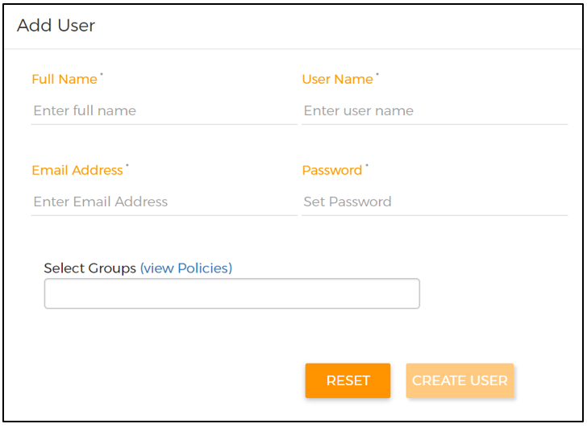
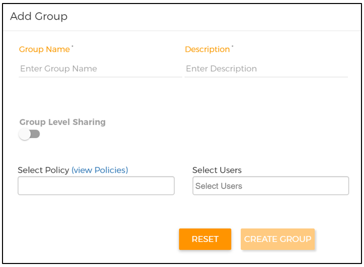
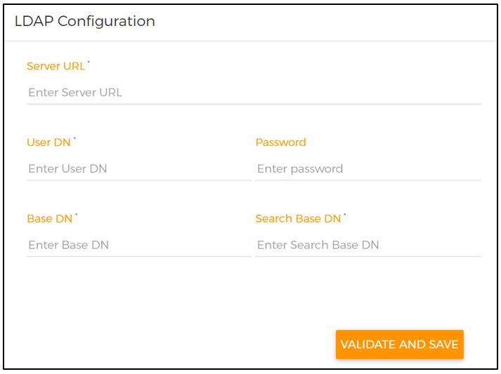
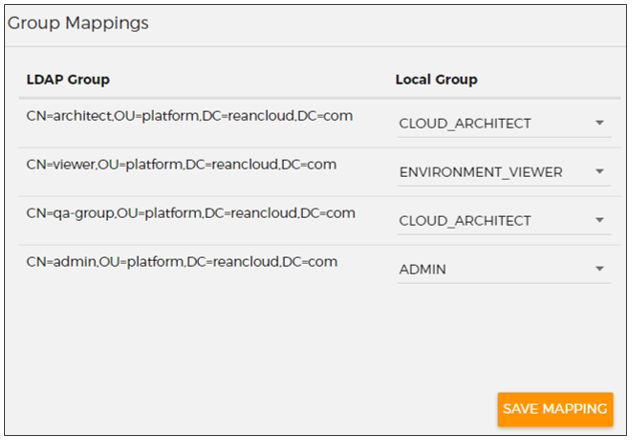

# Administer Cloud Accelerator Platform

This topic describes how to manage groups and users in Hitachi Cloud Accelerator Platform and integrate Cloud Accelerator Platform with Microsoft Active Directory.

## <a name="Content"></a>Contents
* <a href="" ui-sref="rean-platform-docs.accelerator({viewAccelerator: 'rean-platform-common', viewPage: 'administer', viewSection: 'console'})" style="text-decoration:none">Overview of Admin Console</a>
* <a href="" ui-sref="rean-platform-docs.accelerator({viewAccelerator: 'rean-platform-common', viewPage: 'administer', viewSection: 'users'})" style="text-decoration:none">Managing users</a>
* <a href="" ui-sref="rean-platform-docs.accelerator({viewAccelerator: 'rean-platform-common', viewPage: 'administer', viewSection: 'groups'})" style="text-decoration:none">Managing groups</a>
* <a href="" ui-sref="rean-platform-docs.accelerator({viewAccelerator: 'rean-platform-common', viewPage: 'administer', viewSection: 'password-policy'})" style="text-decoration:none">Customizing the password policy for user accounts</a>
* <a href="" ui-sref="rean-platform-docs.accelerator({viewAccelerator: 'rean-platform-common', viewPage: 'administer', viewSection: 'lockout-settings'})" style="text-decoration:none">Customizing user account lockout settings</a>
* <a href="" ui-sref="rean-platform-docs.accelerator({viewAccelerator: 'rean-platform-common', viewPage: 'administer', viewSection: 'session-timeout'})" style="text-decoration:none">Configuring the session timeout for user accounts</a>
* <a href="" ui-sref="rean-platform-docs.accelerator({viewAccelerator: 'rean-platform-common', viewPage: 'administer', viewSection: 'active'})" style="text-decoration:none">Integrating Cloud Accelerator Platform with Active Directory</a>


## <a id="console" name="console"></a>Overview of Admin Console

The Admin Console enables Cloud Accelerator Platform administrators to manage a common set of groups and users for Hitachi Cloud Accelerator Platform - Deploy (Deploy Accelerator), Hitachi Cloud Accelerator Platform - Test (Test Accelerator), Hitachi Cloud Accelerator Platform - Assess (Assess Accelerator), and Hitachi Cloud Accelerator Platform - Migrate (Migrate Accelerator). Each user is assigned to one or more groups. The administrators assign permissions to each group by either selecting policies or configuring share permissions for specific resources. Based on their assigned groups, users can perform different actions in Deploy Accelerator, Assess Accelerator, Test Accelerator, and Migrate Accelerator.<br>

When Cloud Accelerator Platform is successfully deployed, a default administrator is also created with the credentials mentioned in the **customer.yml** file at the time of deployment. If required, this administrator can create additional administrators.<br>

By default, administrators can use the Admin Console to add <a href="" ui-sref="rean-platform-docs.accelerator({viewAccelerator: 'rean-platform-common', viewPage: 'administer', viewSection: 'groups'})" style="text-decoration:none">groups</a> and <a href="" ui-sref="rean-platform-docs.accelerator({viewAccelerator: 'rean-platform-common', viewPage: 'administer', viewSection: 'users'})" style="text-decoration:none">users</a> and assign users to appropriate groups. If required, administrators can modify users or groups, disable users, and delete groups.<br>

Administrators can also <a href="" ui-sref="rean-platform-docs.accelerator({viewAccelerator: 'rean-platform-common', viewPage: 'administer', viewSection: 'active'})" style="text-decoration:none">integrate Cloud Accelerator Platform with an existing setup of Active Directory</a> and manage users and group membership in Active Directory.

## <a id="users" name="users"></a>Managing users

Cloud Accelerator Platform administrators can add and manage users from the Admin Console. They can perform the following actions to manage users:

- <a href="" ui-sref="rean-platform-docs.accelerator({viewAccelerator: 'rean-platform-common', viewPage: 'administer', viewSection: 'add-user'})" style="text-decoration:none">Add a new user</a>
- <a href="" ui-sref="rean-platform-docs.accelerator({viewAccelerator: 'rean-platform-common', viewPage: 'administer', viewSection: 'verify-user'})" style="text-decoration:none">Verify a new user</a>
- <a href="" ui-sref="rean-platform-docs.accelerator({viewAccelerator: 'rean-platform-common', viewPage: 'administer', viewSection: 'modify-user'})" style="text-decoration:none">Modify an existing user</a>
- <a href="" ui-sref="rean-platform-docs.accelerator({viewAccelerator: 'rean-platform-common', viewPage: 'administer', viewSection: 'reset-user-password'})" style="text-decoration:none">Reset the password of an existing user</a>
- <a href="" ui-sref="rean-platform-docs.accelerator({viewAccelerator: 'rean-platform-common', viewPage: 'administer', viewSection: 'unlock-user'})" style="text-decoration:none">Unlock an existing user's account</a>
- <a href="" ui-sref="rean-platform-docs.accelerator({viewAccelerator: 'rean-platform-common', viewPage: 'administer', viewSection: 'disable-user'})" style="text-decoration:none">Disable an existing user</a>

Other users can also <a href="" ui-sref="rean-platform-docs.accelerator({viewAccelerator: 'rean-platform-common', viewPage: 'createAndAccessAccount', viewSection: 'create'})" style="text-decoration:none">create their own Cloud Accelerator Platform account</a> and then request the administrator to assign them to the appropriate group.<br>

_**Note:** If you have <a href="" ui-sref="rean-platform-docs.accelerator({viewAccelerator: 'rean-platform-common', viewPage: 'administer', viewSection: 'active'})" style="text-decoration:none">integrated Cloud Accelerator Platform with Active Directory</a>, you must add and manage users in Active Directory. In that case, administrators can only view user details in the Admin Console._

### <a id="add-user" name="add-user"></a>Add a new user

1. <a href="" ui-sref="rean-platform-docs.accelerator({viewAccelerator: 'rean-platform-common', viewPage: 'createAndAccessAccount', viewSection: 'logon'})" style="text-decoration:none">Sign in to Cloud Accelerator Platform</a> as an administrator.

2. On the Home page, click the **Accelerator** icon () in the top-left corner and select **Admin Console**.

3. Click the **More options** icon () in the top-right corner and then click **Users**.

4. Under **Add User**, enter the full name, user name, email address, and password of the new user.

   

5. From the **Select Groups** list, select the groups to which you want to add the user.

   Cloud Accelerator Platform provides a few <a href="" ui-sref="rean-platform-docs.accelerator({viewAccelerator: 'rean-platform-common', viewPage: 'administer', viewSection: 'default-groups'})" style="text-decoration:none">default groups</a> that you can assign to users based on the actions that they need to perform across different accelerators. Based on the requirements, administrators can also <a href="" ui-sref="rean-platform-docs.accelerator({viewAccelerator: 'rean-platform-common', viewPage: 'administer', viewSection: 'add-group'})" style="text-decoration:none">add new groups</a>.

6. *(Optional)* To view details of the policies that are a part of the selected groups, select **view Policies**.

7. Click **CREATE USER**.

   A new user appears under the **Users List** section.

8. To complete the user creation process, <a href="" ui-sref="rean-platform-docs.accelerator({viewAccelerator: 'rean-platform-common', viewPage: 'administer', viewSection: 'verify-user'})" style="text-decoration:none">verify that user</a>.

   New users can sign in to Cloud Accelerator Platform only after they are successfully verified.

### <a id="verify-user" name="verify-user"></a>Verify a new user

When new users create a Cloud Accelerator Platform account, they receive an email from Cloud Accelerator Platform. To verify their email address and complete the account creation process, users have to click the **login** link in the email. As an administrator, you can also verify new users who have created their own account.  

1. <a href="" ui-sref="rean-platform-docs.accelerator({viewAccelerator: 'rean-platform-common', viewPage: 'createAndAccessAccount', viewSection: 'logon'})" style="text-decoration:none">Sign in to Cloud Accelerator Platform</a> as an administrator.

2. On the Home page, click the **Accelerator** icon () in the top-left corner and select **Admin Console**.

3. Click the **More options** icon () in the top-right corner and then click **Users**.

4. Under **Users List**, in the **Actions** column for the user you want to verify, click **VERIFY**.

5. In the confirmation box, click **YES**.

   The new user is successfully verified and can sign in to Cloud Accelerator Platform.

### <a id="modify-user" name="modify-user"></a>Modify an existing user

1. <a href="" ui-sref="rean-platform-docs.accelerator({viewAccelerator: 'rean-platform-common', viewPage: 'createAndAccessAccount', viewSection: 'logon'})" style="text-decoration:none">Sign in to Cloud Accelerator Platform</a> as an administrator.
2. On the Home page, click the **Accelerator** icon () in the top-left corner and select **Admin Console**.
3. Click the **More options** icon () in the top-right corner and then click **Users**.
4. Under **Users List**, in the **Actions** column for the user whose details you want to modify, click **EDIT**.
5. Under **Edit User**, make the required changes.
6. Click **SAVE USER**.

### <a id="reset-user-password" name="reset-user-password"></a>Reset the password of an existing user

1. <a href="" ui-sref="rean-platform-docs.accelerator({viewAccelerator: 'rean-platform-common', viewPage: 'createAndAccessAccount', viewSection: 'logon'})" style="text-decoration:none">Sign in to Cloud Accelerator Platform</a> as an administrator.

2. On the Home page, click the **Accelerator** icon () in the top-left corner and select **Admin Console**.

3. Click the **More options** icon () in the top-right corner and then click **Users**.

4. Under **Users List**, in the **Actions** column for the user whose password you want to reset, click **Reset Password**.

5. In the Reset Password window, enter a new password, re-enter the new password, and click **SUBMIT**.

   After the password is reset successfully, you can share the new password with the user. 

### <a id="unlock-user" name="unlock-user"></a>Unlock an existing user's account

If users fail to sign into their Cloud Accelerator Platform account in three consecutive attempts, their account is locked for two hours. If required, administrators can unlock a user's account during this lockout duration.

1. <a href="" ui-sref="rean-platform-docs.accelerator({viewAccelerator: 'rean-platform-common', viewPage: 'createAndAccessAccount', viewSection: 'logon'})" style="text-decoration:none">Sign in to Cloud Accelerator Platform</a> as an administrator.
2. On the Home page, click the **Accelerator** icon () in the top-left corner and select **Admin Console**.
3. Click the **More options** icon () in the top-right corner and then click **Users**.
4. Under **Users List**, in the **Actions** column for the user whose account you want to unlock, click **ENABLE**.

_**Note:** Administrators can also configure default values for the number of failed sign-in attempts and the lockout duration For more information, see <a href="" ui-sref="rean-platform-docs.accelerator({viewAccelerator: 'rean-platform-common', viewPage: 'administer', viewSection: 'lockout-settings'})" style="text-decoration:none">Customizing user account lockout settings</a>._

### <a id="disable-user" name="disable-user"></a>Disable an existing user

You can disable users to prevent them from signing in to their Cloud Accelerator Platform account. However, the entities that these users have created are not removed. While disabling a user, you can select a policy-based group with which the user's entities can be shared. Other users in the selected group can then access these shared entities.

1. <a href="" ui-sref="rean-platform-docs.accelerator({viewAccelerator: 'rean-platform-common', viewPage: 'createAndAccessAccount', viewSection: 'logon'})" style="text-decoration:none">Sign in to Cloud Accelerator Platform</a> as an administrator.

2. On the Home page, click the **Accelerator** icon () in the top-left corner and select **Admin Console**.

3. Click the **More options** icon () icon in the top-right corner and then click **Users**.

4. Under **Users List**, in the **Actions** column for the user that you want to disable, click **DISABLE**.

5. _(Optional)_ In the Share Entities window, select the policy-based group with which you want to share the following Deploy Accelerator entities that the selected user owns:

   - Environments
   - Deployments
   - Providers
   - Connections
   - Chef Server packages

   _**Note:** To share test jobs that the user has created in Test Accelerator, you can add the user to a group in which share permissions for the appropriate tests are configured. This action ensures that other users in that group can continue to access the test jobs created by the user you have disabled. For more information, see <a href="" ui-sref="rean-platform-docs.accelerator({viewAccelerator: 'rean-platform-common', viewPage: 'administer', viewSection: 'groups'})" style="text-decoration:none">Managing groups</a>._

6. Click **SUBMIT**.

   The user can no longer sign in to Cloud Accelerator Platform. Also, the shared entities of this user can now be accessed by other users in the selected group. The actions that they can perform on the shared entities is based on the policies assigned to the group.

_**Note:** To enable a user that you have previously disabled, under the **Users List** section, in the **Actions** column for that user, click **ENABLE**. This user can once again sign in to Cloud Accelerator Platform and access all previously-owned entities. In this case, users in the group that was selected while disabling the user can no longer access the shared entities of this user._


## <a id="groups" name="groups"></a>Managing groups

Cloud Accelerator Platform provides a few <a href="" ui-sref="rean-platform-docs.accelerator({viewAccelerator: 'rean-platform-common', viewPage: 'administer', viewSection: 'default-groups'})" style="text-decoration:none">default groups</a> that administrators can assign to users. If required, you can also <a href="" ui-sref="rean-platform-docs.accelerator({viewAccelerator: 'rean-platform-common', viewPage: 'administer', viewSection: 'add-group'})" style="text-decoration:none">add new groups</a> or <a href="" ui-sref="rean-platform-docs.accelerator({viewAccelerator: 'rean-platform-common', viewPage: 'administer', viewSection: 'modify-group'})" style="text-decoration:none">modify existing groups</a> from the Admin Console.<br>

You can add multiple users in a group and configure permissions for the group in one of the following ways:

- **Assign out-of-the-box policies** (**Select Policy**)

  While adding a new group, you can select one or more policies based on the permissions that you want to assign to users in the group. Cloud Accelerator Platform provides many out-of-the-box policies that provide permissions to perform specific actions. For example, the **ManualTestViewCreate** policy provides the permission to create and view manual test jobs in Test Accelerator.

- **Configure share permissions for specific resources** (**Group-Level Sharing**)

  While adding a new group, you can configure share permissions for an out-of-the-box list of resources . Based on the assigned share permissions, users within the group can view each other's resources and perform other actions based on the permissions. For example, the **View** permission for the **ManualTest** resource in Test Accelerator enables users within the group to view each other's manual test jobs.

  However, the users within this group must also be a part of another group that contains appropriate policies to perform the selected actions on the shared resources. For example, to view each other's manual test jobs, users must also be assigned to another policy-based group that gives them the basic permission to view manual test jobs.

_**Note:** You can continue to add and manage Cloud Accelerator Platform groups in the Admin Console even after you have <a href="" ui-sref="rean-platform-docs.accelerator({viewAccelerator: 'rean-platform-common', viewPage: 'administer', viewSection: 'active'})" style="text-decoration:none">integrated Cloud Accelerator Platform with Active Directory</a>._

### <a id ="default-groups" name ="default-groups"></a>Default groups

The following table lists the default groups that are available in the Admin Console. While <a href="" ui-sref="rean-platform-docs.accelerator({viewAccelerator: 'rean-platform-common', viewPage: 'administer', viewSection: 'add-user'})" style="text-decoration:none">adding users</a>, administrators can assign them to the appropriate groups based on the actions that they need to perform across different accelerators. Based on the requirements, you can also <a href="" ui-sref="rean-platform-docs.accelerator({viewAccelerator: 'rean-platform-common', viewPage: 'administer', viewSection: 'add-group'})" style="text-decoration:none">add a new group</a> and configure the appropriate policies (access level) for that group.

| Group                              | Accelerator                                                  | Access level                                                 |
| ---------------------------------- | ------------------------------------------------------------ | ------------------------------------------------------------ |
| ADMIN                              | -- Assess Accelerator<br>-- Deploy Accelerator<br>-- Test Accelerator | This group allows users to perform all admin-related tasks, such as manage users and groups in Admin Console, add Chef Servers in Deploy Accelerator, and configure Test Accelerator. |
| CLOUD_ARCHITECT                    | -- Assess Accelerator<br>-- Deploy Accelerator               | This group allows users to perform multiple operations, such as create environments, import environments, view environments, edit environments, deploy environments, create and manage providers, create and manage connections, destroy environments, delete environments, export environments as blueprints, run assessment policies, view assessment policy reports, download assessment policy reports, and customize assessment policy reports. |
| DEFAULT                            | -- Assess Accelerator<br>-- Deploy Accelerator<br>-- Test Accelerator | This group allows users to update their profile information.<br><br>_**Note:** If users create their own Cloud Accelerator Platform account or if you do not select a group while creating users, the DEFAULT group is automatically assigned to these users._ |
| ENVIRONMENT_USER                   | Deploy Accelerator                                           | This group allows users to deploy and destroy environments.  |
| ENVIRONMENT_VIEWER                 | Deploy Accelerator                                           | This group allows users to view all connections, providers, and environments. |
| FREE_TRIALS                        | -- Assess Accelerator<br>-- Deploy Accelerator               | This group allows users to create a limited number of new connections, providers, and environments. |
| hcaptest-user                      | Test Accelerator                                             | This group allows users to run and manage test jobs, view tests results, create and manage job schedules, view provider details, and view configuration details. |
| hcaptest-view                      | Test Accelerator                                             | This group allows users to view test jobs, test results, job schedules, provider details, and configuration details in Test Accelerator. |
| HELM_USER                          | Workflow Accelerator                                         | This group allows users to create Helm repositories and deploy Helm charts using Workflow Accelerator solution packages. |
| HELM_VIEWER                        | Workflow Accelerator                                         | This group allows users to only view Helm repository and Helm chart data defined in Workflow Accelerator solution packages. |
| MIGRATE_USER                       | Migrate Accelerator                                          | This group allows users to perform all actions in Migrate Accelerator, such as create discovery and migration jobs, connections, and migration credentials. |
| MIGRATE_VIEWER                     | Migrate Accelerator                                          | This group allows users to only view data in Migrate Accelerator. |
| PROVIDER_USER                      | Migrate Accelerator                                          | This group allows Migrate Accelerator users to create and edit the providers they have created. |
| PROVIDER_VIEWER                    | Migrate Accelerator                                          | This group allows Migrate Accelerator users to only view the providers they have previously created. |
| SOLUTION_PACKAGE_DEPLOYMENT_USER   | Workflow Accelerator                                         | This group allows users to deploy registered solution packages. |
| SOLUTION_PACKAGE_DEPLOYMENT_VIEWER | Workflow Accelerator                                         | This group allows users to only view deployment data for registered solution packages. |
| SOLUTION_PACKAGE_USER              | Workflow Accelerator                                         | This group allows users to perform all operations on solution packages, including creating and registering solution packages |
| SOLUTION_PACKAGE_VIEWER            | Workflow Accelerator                                         | This group allows users to only view data for registered solution packages. |
| VIEW_ALL_USER'S_ENTITIES           | Deploy Accelerator                                           | This group allows users to <a href="" ui-sref="rean-platform-docs.accelerator({viewAccelerator: 'rean-deploy', viewPage: 'deploy-and-manage-environments', viewSection: 'access-env'})" style="text-decoration:none">view the environments and deployments of all users in Deploy Accelerator</a>.<br><br>It also allows users to view additional entities (providers, connections, and packages) of all users in Deploy Accelerator but only by using API commands.<br><br>However, to perform any actions on these entities, users must also be members of the ADMIN group.<br><br>_**Note:** You cannot view or modify the policies that are attached to the VIEW_ALL_USER'S ENTITIES groups._ |

### <a id="add-group" name="add-group"></a>Add a new group

While adding a new group, you can either assign out-of-the-box policies to the group or assign share permissions for specific resources.

1. <a href="" ui-sref="rean-platform-docs.accelerator({viewAccelerator: 'rean-platform-common', viewPage: 'createAndAccessAccount', viewSection: 'logon'})" style="text-decoration:none">Sign in to Cloud Accelerator Platform</a> as an administrator.

2. On the Home page, click the **Accelerator** icon () in the top-left corner and select **Admin Console**.

3. Click the **More options** icon () icon in the top-right corner and then click **Groups**.

4. Under **Add Group**, enter the group name and description.

   

5. To assign policies to the group, perform the following actions:

   - From the **Select Policy** list, select the appropriate policies.

      By selecting a policy, you are adding permissions that are attached to the policy. 

      _**Note:** You can add a new group without selecting a policy._

   - *(Optional)* To view details of the selected policies, select **view Policies**.

   - From the **Select Users** list, select the users you want to add to this group.

      The selected users get permissions attached to the selected policies.

6. To assign share permissions for specific resources to the group, perform the following actions:

   - Turn on the **Group Level Sharing** toggle.

      The resources for which you can configure share permissions appear under the **Select Resources** section.

      _**Important:** You can currently configure share permissions for only Test Accelerator resources._

   - Expand the resource for which you want to configure share permissions and select the appropriate permission check boxes. 

      Repeat this step for each resource for which you want to configure share permissions. 

      _**Note:** In the case of Test Accelerator resources, ensure that you select the **View** permission along with other permissions, such as **Stop** and **Schedule**._

   - From the **Select Users** list, select the users you want to add to this group.

      The selected users can view the resources created by other users in the group. They can also perform other actions based on the additional permissions that are selected for that resource.

      _**Note:** The selected users must also be a part of another group that contains appropriate policies to perform the selected actions on the shared resources. For example, to schedule test jobs, users must also be a part of the **reantest-user** group._

7. Click **CREATE GROUP**.

   A new group appears under the **Groups List** section.

### <a id="modify-group" name="modify-group"></a>Modify an existing group

1. <a href="" ui-sref="rean-platform-docs.accelerator({viewAccelerator: 'rean-platform-common', viewPage: 'createAndAccessAccount', viewSection: 'logon'})" style="text-decoration:none">Sign in to Cloud Accelerator Platform</a> as an administrator.

2. On the Home page, click the **Accelerator** icon () in the top-left corner and select **Admin Console**.

3. Click the **More options** icon () in the top-right corner and then click **Groups**.

4. Under **Groups List**, in the **Actions** column for the group that you want to modify, perform one of the following actions:

   - To add users to the group, click **EDIT**, make the required changes under the **Edit Group** section, and click **SAVE GROUP**.

   - To delete the group, click **DELETE**.

     You can delete a group only if it does not have any selected policies or assigned users. 

## <a id="password-policy" name="password-policy"></a>Customizing the password policy for user accounts

By default, the following password policy is used for user accounts in Cloud Accelerator Platform:

- Password must be between 10 and 50 characters in length.
- Password must be a mix of upper and lower case characters.
- Password must have at least one numeric character.

Administrators can choose to customize the password policy by setting any of the following parameters:

- Maximum length
- Minimum length
- Minimum special characters
- Minimum digit characters (numeric characters)
- Minimum upper case characters
- Minimum lower case characters 

The values that you set for these parameters do not have to be within any pre-defined range. However, you must ensure that the values that you set do not contradict each other. For example, if you set the value of minimum special, upper case, lower case, and numeric characters to three each, your minimum length value must be at least 12.

_**Note:** To customize the password policy for user accounts, you must have administrative access to the instance on which Cloud Accelerator Platform is deployed._

**To customize the password policy for user accounts, perform the following actions:**

1. Connect to the instance on which Cloud Accelerator Platform is deployed.

2. Locate the **${PLATFORM_HOME}/deployment** folder.

3. Open the **core.yml** file and locate the **services: authnz: environment** section.

4. If the **PWD_POLICY** property is not available in the **core.yml** file, add the property.

5. For the **PWD_POLICY** property, set one or more of the following parameters: 

   - max_length
   - min_length
   - min_spl_chars
   - min_digits 
   - min_upper_case_chars
   - min_lower_case_chars

   The parameters that you set must be comma separated, as shown in the example below.

   `PWD_POLICY: min_upper_case_chars=3,min_lower_case_chars=6,min_length=9,max_length=20`

6. Save the **core.yml** file.

7. Restart the **rean-core** service.

## <a id="lockout-settings" name="lockout-settings"></a>Customizing user account lockout settings

By default, Cloud Accelerator Platform users are locked out of their account for two hours after three unsuccessful sign-in attempts. If required, administrators can modify the number of failed sign-in attempts and the lockout duration.

_**Note:** To customize the lockout settings for user accounts, you must have administrative access to the instance on which Cloud Accelerator Platform is deployed._

**To customize lockout settings for user accounts, perform the following actions:**

1. Connect to the instance on which Cloud Accelerator Platform is deployed.

2. Locate the **${PLATFORM_HOME}/deployment** folder.

3. Open the **core.yml** file and locate the **services: authnz: environment** section.

4. To modify the number of failed login attempts, perform the following actions:

   - If the **rean.platform.security.brute.failed_attempts** property is not available in the **core.yml** file, add the property.

   - Update the number of failed sign-in attempts, as shown below:

     `rean.platform.security.brute.failed_attempts=${BRUTE_FAILED_ATTEMPTS:5}`

5. To modify the lockout duration, perform the following actions:

   - If the **rean.platform.security.brute.locked_duration_in_min** property is not available in the **core.yml** file, add the property.

   - Update the lockout duration (in minutes), as shown below:

     `rean.platform.security.brute.locked_duration_in_min=${BRUTE_LOCKED_DURATION_IN_MIN:60}`

6. Save the **core.yml** file.

7. Restart the **rean-core** service.

## <a id="session-timeout" name="session-timeout"></a>Configuring the session timeout for user accounts

By default, Cloud Accelerator Platform users are automatically logged out of their account if they do not perform any action for 30 minutes. If required, administrators can modify this session timeout duration (in minutes).<br>

If users close their browser tab or window, their working session remains active for the duration that is configured.<br>

_**Note:** To configure the session timeout duration, you must have administrative access to the instance on which Cloud Accelerator Platform is deployed._

**To configure the session timeout for user accounts, perform the following actions:**

1. Connect to the instance on which Cloud Accelerator Platform is deployed.

2. Locate the **${PLATFORM_HOME}/deployment** folder.

3. Open the **core.yml** file and locate the **services: apigateway: environment** section.

4. If the **com.reancloud.platform.token.expiration.time** property is not available in the **core.yml** file, add the property.

5. Update the session timeout duration (in minutes), as shown below:

   `com.reancloud.platform.token.expiration.time=45`

6. Save the **core.yml** file.

7. Restart the **rean-core** service.

## <a id="active" name="active"></a>Integrating Cloud Accelerator Platform with Active Directory

Cloud Accelerator Platform enables you to use your existing Microsoft Active Directory setup to authenticate users in Cloud Accelerator Platform and provide user-group authorization. In this case, you can only view users in the Admin Console.<br>

As a part of configuring this integration, administrators must map Active Directory groups to the appropriate Cloud Accelerator Platform groups. At least one Active Directory group must be mapped to the ADMIN group in Cloud Accelerator Platform. Users who are members of this Active Directory group can access the Admin Console. Going forward, they can manage groups, update the group mapping, and view users in the Admin Console. However, they can add and delete users only in Active Directory.<br>

After the Active Directory integration is completed, users need to <a href="" ui-sref="rean-platform-docs.accelerator({viewAccelerator: 'rean-platform-common', viewPage: 'createAndAccessAccount', viewSection: 'logon'})" style="text-decoration:none">sign in to Cloud Accelerator Platform</a> with their Active Directory email ID and password. Cloud Accelerator Platform uses Active Directory to authenticate users. The authenticated users can perform actions based on the C loud Accelerator Platform group that is mapped to their Active Directory group.

If Cloud Accelerator Platform is in use before it is integrated with Active Directory, you must <a href="" ui-sref="rean-platform-docs.accelerator({viewAccelerator: 'rean-platform-common', viewPage: 'administer', viewSection: 'migrate-ad-users'})" style="text-decoration:none">migrate existing users from Cloud Accelerator Platform to Active Directory</a>.  

_**Note:** Administrators can integrate Cloud Accelerator Platform with only one Active Directory server._

### <a id="before-ad" name="before-ad"></a>Before you begin

Before you configure the Active Directory server in the Admin Console, ensure that you have performed the following actions:

- Whitelisted the Cloud Accelerator Platform server's IP address in the Active Directory server's security group.

- Ensured that the email ID of the default administrator in Cloud Accelerator Platform is added in Active Directory.

- Configured the **LDAP_ADMIN_USERDN** and **LDAP_ADMIN_PASSWORD** properties in the **customer.yml** file, as shown in the following example:

  ```
  LDAP_ADMIN_USERDN=CN=Administrator,CN=Users,DC=reancloud,DC=com
  LDAP_ADMIN_PASSWORD=D$jn*JHG)
  ```

- _(Only if you want to use LDAP over SSL)_ Copied the certificate that you have generated while setting up Active Directory to the **cacert** folder on the Cloud Accelerator Platform instance.

- Restarted the Cloud Accelerator Platform services after updating the **customer.yml** file and copying the certificate to the **cacert** folder. 

### <a id="configure-ad" name="configure-ad"></a>Configure the Active Directory server

1. <a href="" ui-sref="rean-platform-docs.accelerator({viewAccelerator: 'rean-platform-common', viewPage: 'createAndAccessAccount', viewSection: 'logon'})" style="text-decoration:none">Sign in to Cloud Accelerator Platform</a> as an administrator.

2. On the Home page, click the **Accelerator** icon () in the top-left corner and select **Admin Console**.

3. Click the **More options** () in the top-right corner and then click **LDAP Configuration**.

   

4. Under **LDAP Configuration**, enter the following information:

   | Field          | Description                                                  |
   | -------------- | ------------------------------------------------------------ |
   | Server URL     | URL of the server on which Active Directory is configured.<br><br>To use LDAP over SSL, you must specify the URL in the following format:<br>**ldaps://*HostName*:636** |
   | User DN        | A unique user name that is used to find the administrator user in Active Directory. |
   | Password       | Password of the administrator user specified in **User DN**. |
   | Base DN        | A Base DN in Active Directory that is used to authenticate users. |
   | Search Base DN | A Base DN in Active Directory that is used to search for groups. |

5. Click **VALIDATE AND SAVE**.

6. In the confirmation message box, click **SAVE** to enable Active Directory integration.

   After you have successfully integrated Cloud Accelerator Platform with Active Directory, the Active Directory groups that are available in the Organization Unit (OU) specified in **Search Base DN** appear under the **Group Mappings** section.

7. <a href="" ui-sref="rean-platform-docs.accelerator({viewAccelerator: 'rean-platform-common', viewPage: 'administer', viewSection: 'map-ad'})" style="text-decoration:none">Map Active Directory and Cloud Accelerator Platform groups</a>.


### <a id="map-ad" name="map-ad"></a>Map Active Directory and Cloud Accelerator Platform groups

After you have successfully integrated Cloud Accelerator Platform with Active Directory, the Active Directory groups appear under the **Group Mappings** section based on your configuration. You must map these Active Directory groups to the appropriate Cloud Accelerator Platform groups.

_**Important:** You must map at least one Active Directory group to the **ADMIN** group in Cloud Accelerator Platform. This Active Directory group must contain users who should be given administrative permissions in Cloud Accelerator Platform._

**To map Active Directory and Cloud Accelerator Platform groups, perform the following actions:**

1. <a href="" ui-sref="rean-platform-docs.accelerator({viewAccelerator: 'rean-platform-common', viewPage: 'createAndAccessAccount', viewSection: 'logon'})" style="text-decoration:none">Sign in to Cloud Accelerator Platform</a> as an administrator.

2. On the Home page, click the **Accelerator** icon () in the top-left corner and select **Admin Console**.

3. Click the **More options** icon () in the top-right corner and then click **LDAP Configuration**.

4. Under **Group Mappings**, in the **Local Group** column for an Active Directory group, select the appropriate Cloud Accelerator Platform group.

   

5. Repeat step 4 for each Active Directory group that is listed in the **LDAP Group** column.

6. Click **SAVE MAPPINGS**.

   _**Note:** You can continue to <a href="" ui-sref="rean-platform-docs.accelerator({viewAccelerator: 'rean-platform-common', viewPage: 'administer', viewSection: 'groups'})" style="text-decoration:none">add and manage groups in the Admin Console</a> even after you have integrated Cloud Accelerator Platform with Active Directory._

### <a id="view-ad-users" name="view-ad-users"></a>View Active Directory users

After the Active Directory integration is completed, you can only view user details in the Admin Console. You must add and manage users in Active Directory.

1. <a href="" ui-sref="rean-platform-docs.accelerator({viewAccelerator: 'rean-platform-common', viewPage: 'createAndAccessAccount', viewSection: 'logon'})" style="text-decoration:none">Sign in to Cloud Accelerator Platform</a> as an administrator.
2. On the Home page, click the **Accelerator** icon () in the top-left corner and select **Admin Console**.
3. Click the **More options** icon () in the top-right corner and then click **Users**.
4. Under **Users List**, select the user whose details you want to view.

### <a id="migrate-ad-users" name="migrate-ad-users"></a>Migrate users from Cloud Accelerator Platform to Active Directory

If Cloud Accelerator Platform is in use before it is integrated with Active Directory, you must migrate the existing Cloud Accelerator Platform users to Active Directory. The data owned by the Cloud Accelerator Platform users must be available after the Active Directory integration is completed. 

#### <a id="migrate-admin" name="migrate-admin"></a>Migrate the default administrator user to Active Directory

Consider the following points while migrating the default administrator user:

- The user whose email ID was provided while deploying Cloud Accelerator Platform is considered as the default administrator of Cloud Accelerator Platform, irrespective of authorization groups association.
- The user who is integrating Cloud Accelerator Platform with Active Directory must ensure that the Active Directory has a user with the email ID of default administrator.
- After Active Directory integration is completed, the default administrator user must use the Active Directory credentials to sign in to Cloud Accelerator Platform.

#### <a id="migrate-existing-users" name="migrate-existing-users"></a>Migrate existing users to Active Directory

Consider the following points while migrating existing Cloud Accelerator Platform users:

- If the email IDs of existing Cloud Accelerator Platform users are the same as in Active Directory, the Active Directory users automatically get mapped to Cloud Accelerator Platform users.
- All the data (environments, providers, connections, and so on) associated with the existing Cloud Accelerator Platform users is available to the Active Directory users with the same email IDs.
- The existing Cloud Accelerator Platform users must use the Active Directory credentials to sign in to Cloud Accelerator Platform.
- If the email IDs of existing Cloud Accelerator Platform users are not available in Active Directory, the existing Cloud Accelerator Platform users are not able to sign in to Cloud Accelerator Platform.

<!-- directive

## <a id="stop-platform" name="stop-platform"></a>Stopping and restarting Cloud Accelerator Platform

You might need to stop and restart Cloud Accelerator Platform in different scenarios. For example, if you update any containers after deploying the accelerators, you must restart Cloud Accelerator Platform. 

1. Connect to the EC2 instance on which Cloud Accelerator Platform is deployed.

2. On the EC2 instance, navigate to the folder where you extracted the Cloud Accelerator Platform deployment code.

3. Navigate to the **deployment** folder within the **REAN-Platform** folder.

4. To stop Cloud Accelerator Platform, run one of the following commands:

   - If you have configured Cloud Accelerator Platform to use Amazon RDS, run the following command: 

     ```
     docker-compose -f core.yml -f reandeploy.yml -f reanassess.yml -f reantest.yml stop
     ```

   - If you are have configured REAN Accelerator Platform to use MySQL in a container, run the following command:

     ```
     docker-compose -f core-db.yml -f reandeploy-db.yml -f reantest-db.yml -f core.yml -f reandeploy.yml -f reanassess.yml -f reantest.yml stop
     ```

5. To restart Cloud Accelerator Platform, run one of the following commands:

   - If you have configured Cloud Accelerator Platform to use Amazon RDS, run the following command: 

     ```
     docker-compose -f core.yml -f reandeploy.yml -f reanassess.yml -f reantest.yml restart
     ```

   - If you are have configured Cloud Accelerator Platform to use MySQL in a container, run the following command:

     ```
     docker-compose -f core-db.yml -f reandeploy-db.yml -f reantest-db.yml -f core.yml -f reandeploy.yml -f reanassess.yml -f reantest.yml restart
     ```

-->