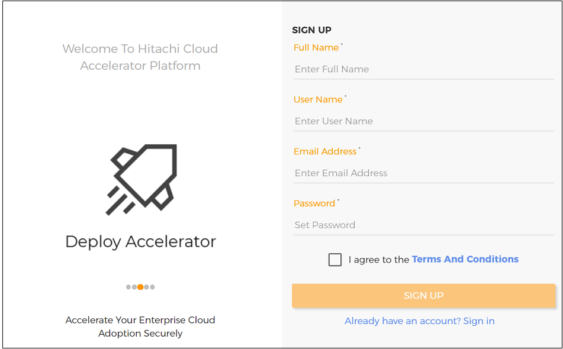
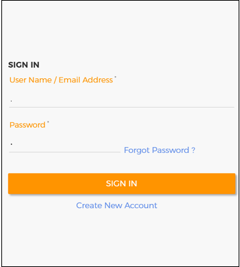
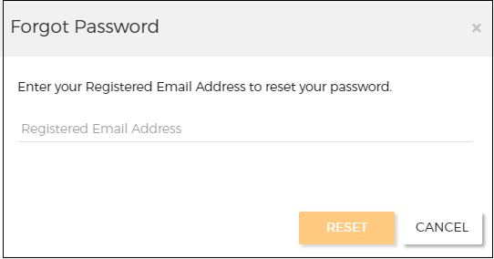
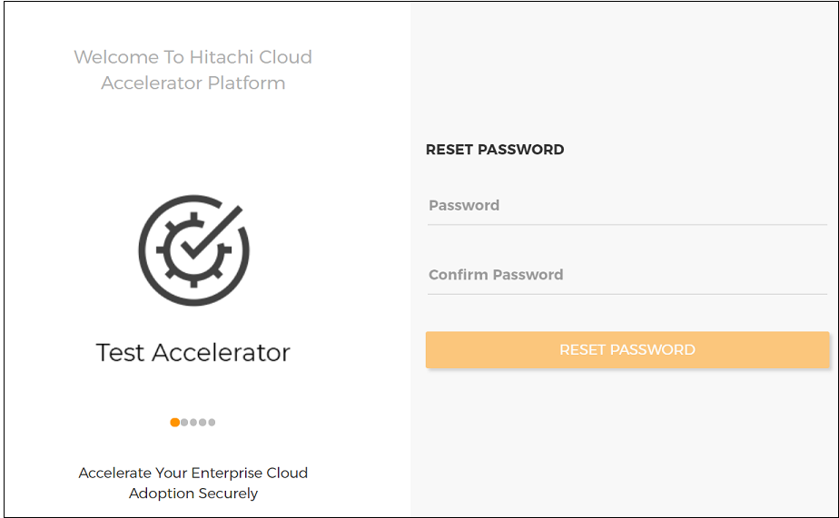
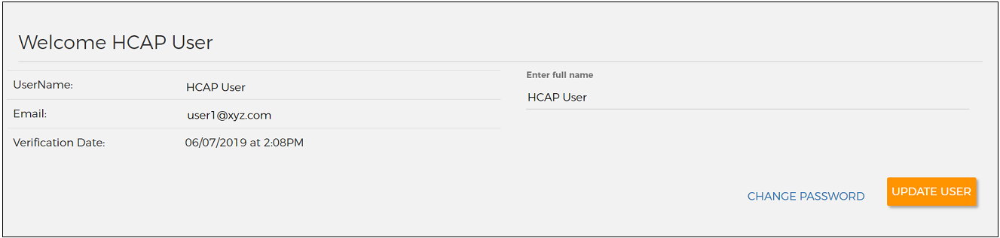
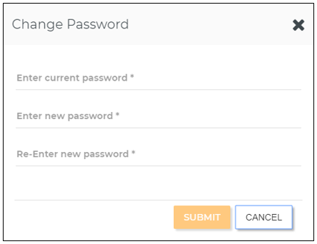

# Create and access Cloud Accelerator Platform account

This topic helps you to create a Hitachi Cloud Accelerator Platform account. It also describes how to sign in to Cloud Accelerator Platform, reset a forgotten password, change your password, and set user preferences.

## Contents
* <a href="" ui-sref="rean-platform-docs.accelerator({viewAccelerator: 'rean-platform-common', viewPage: 'createAndAccessAccount', viewSection: 'create'})" style="text-decoration:none">Creating a Cloud Accelerator Platform account</a>
* <a href="" ui-sref="rean-platform-docs.accelerator({viewAccelerator: 'rean-platform-common', viewPage: 'createAndAccessAccount', viewSection: 'logon'})" style="text-decoration:none">Signing in to Cloud Accelerator Platform</a>
* <a href="" ui-sref="rean-platform-docs.accelerator({viewAccelerator: 'rean-platform-common', viewPage: 'createAndAccessAccount', viewSection: 'forgot'})" style="text-decoration:none">Resetting a forgotten password</a>
* <a href="" ui-sref="rean-platform-docs.accelerator({viewAccelerator: 'rean-platform-common', viewPage: 'createAndAccessAccount', viewSection: 'password'})" style="text-decoration:none">Changing your password</a>
* <a href="" ui-sref="rean-platform-docs.accelerator({viewAccelerator: 'rean-platform-common', viewPage: 'createAndAccessAccount', viewSection: 'preferences'})" style="text-decoration:none">Setting user preferences</a>

_**Note:** Make sure that you use a browser that Cloud Accelerator Platform supports. For the complete list of browsers, see <a href="" ui-sref="rean-platform-docs.accelerator({viewAccelerator: 'rean-platform-common', viewPage: 'getStarted', viewSection: 'supported-browsers'})" style="text-decoration:none">Supported browsers and resolution</a>._

## Creating a Cloud Accelerator Platform account

1. In a browser, type the Cloud Accelerator Platform URL.

2. Click **Create New Account**.

3. Enter your full name, user name, email address, and password.

   

4. Select **I agree to the Terms and Conditions**.

5. Click **SIGN UP**.

   An email is sent to the email ID that you have specified.

6. Sign in to the email account that you have specified and open the email that you have received from Cloud Accelerator Platform.

7. To verify your email address and complete your account creation, select the **login** link in the email.

8. Contact your Cloud Accelerator Platform administrator and request for the appropriate permissions to perform various actions in the following accelerators:

   - Hitachi Cloud Accelerator Platform - Deploy (Deploy Accelerator)
   - Hitachi Cloud Accelerator Platform - Test (Test Accelerator)
   - Hitachi Cloud Accelerator Platform - Assess (Assess Accelerator)
   - Hitachi Cloud Accelerator Platform - Migrate (Migrate Accelerator)

   For more information about user permissions, see <a href="" ui-sref="rean-platform-docs.accelerator({viewAccelerator: 'rean-platform-common', viewPage: 'administer', viewSection: 'users'})" style="text-decoration:none">Managing users</a>. 

## Signing in to Cloud Accelerator Platform

After signing in to Cloud Accelerator Platform, you can perform various actions only if your administrator has granted you the appropriate permissions.

1. In a browser, type the Cloud Accelerator Platform URL.

2. Enter your user name or email address and your password.

   

3. Click **SIGN IN**.

   After you are signed in, you can see the Home page of Deploy Accelerator.

   

   _**Note:** By default, if you fail to sign in to your account in three consecutive attempts, you are locked out of your account for two hours. However, your administrator might have <a href="" ui-sref="rean-platform-docs.accelerator({viewAccelerator: 'rean-platform-common', viewPage: 'administer', viewSection: 'lockout-settings'})" style="text-decoration:none">customized the user account lockout settings</a>. If required, you can request your administrator to <a href="" ui-sref="rean-platform-docs.accelerator({viewAccelerator: 'rean-platform-common', viewPage: 'administer', viewSection: 'unlock-user'})" style="text-decoration:none">unlock your user account</a>._ 

4. _(Optional)_ To access other accelerators, click the **Accelerator** icon () in the top-left corner and select one of the following accelerators:

   - Hitachi Cloud Accelerator Platform - Test
   - Hitachi Cloud Accelerator Platform - Assess
   - Hitachi Cloud Accelerator Platform - Migrate

!!!_**Note:** You are automatically signed out of Cloud Accelerator Platform if you do not perform any action for 30 minutes or for the <a href="" ui-sref="rean-platform-docs.accelerator({viewAccelerator: 'rean-platform-common', viewPage: 'administer', viewSection: 'session-timeout'})" style="text-decoration:none">session timeout duration that your administrator has configured</a>. If you close the browser tab or window, your working session remains active for the duration that is configured._

## Resetting a forgotten password

1. In a browser, type the Cloud Accelerator Platform URL.

2. Click **Forgot Password**.

   _**Note:** The **Forgot Password** link is not available if your administrator has integrated Microsoft Active Directory with Cloud Accelerator Platform. You can submit a request for a new password to your Active Directory administrator._

3. In the Forgot Password window, enter your registered email address and click **RESET**.

   

   A reset password email is sent to your registered email address.

4. Sign in to your registered email account and open the email that you have received from Cloud Accelerator Platform.

5. In the email, select the link to reset your password.

6. On the Reset Password page, enter your new password and click **RESET PASSWORD**.

   

7. <a href="" ui-sref="rean-platform-docs.accelerator({viewAccelerator: 'rean-platform-common', viewPage: 'createAndAccessAccount', viewSection: 'logon'})" style="text-decoration:none">Sign in to Cloud Accelerator Platform</a> with your new password.

## Changing your password

1. On the Home page, click the **User** icon ().

2. Click your **User name**.

3. On the Welcome page, click **CHANGE PASSWORD**.

   

   _**Note:** The **CHANGE PASSWORD** link is not available if your administrator has integrated Active Directory with Cloud Accelerator Platform. You can submit a request to change your password to your Active Directory administrator._

4. In the Change Password window, enter your current password and new password, and then re-enter your new password.

   

5. Click **SUBMIT**.

6. _(Optional)_ On the Welcome page, edit your full name and click **UPDATE USER**.

## Setting user preferences

1. On the Home page, click the **User** icon ().

2. Click **Preferences**.

3. In the User Preferences window, on the **Deploy** tab, set your preferences.

   Currently, you can set your preferences only for email notifications that are sent when deployments are started or destroyed in Deploy Accelerator.

   

   _**Note:** The environment-level settings have the highest precedence, followed by user-level settings, and finally application-level (default) settings._ 

4. To set your preferences for email notifications, perform the following actions:

   - To receive all email notifications for completion of the deploy/destroy process, in **Enable Deploy/Destroy Complete Notifications**, select **True**. 
   - To receive email notifications for initiation of the deploy/destroy process, in **Enable Deploy/Destroy Initiation Notifications**, select **True**.
   - To not receive email notifications for any of the above notifications, select **False**.
   - To apply application level settings, select **Default**. 
5. To revert your preferences to the last-saved settings, click **DISCARD**.

6. To reset your preferences to their default value, perform the following actions:

   - To reset a specific preference, click the **Reset** link next to that preference and then click **SAVE**.

   - To reset all your preferences, click **RESET ALL PREFERENCES**.

     In the confirmation message box, click **YES**.