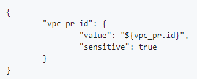

# Frequently Asked Questions (FAQ)

Hitachi Cloud Accelerator Platform drives Enterprise Digital Transformation and enables the adoption of DevOps Principles to deliver Enterprise Workloads in the Cloud. It comprises a set of tools that help you to accelerate the Deploy, Verify, and Manage phases of your journey toward Cloud Adoption. 

This topic provides answers to frequently asked questions about accelerators.

## Contents

- <a href="" ui-sref="rean-platform-docs.faqs({viewSection: 'platform'})" style="text-decoration:none">Cloud Accelerator Platform FAQs</a>
- <a href="" ui-sref="rean-platform-docs.faqs({viewSection: 'admin'})" style="text-decoration:none">Admin Console FAQs</a>
- <a href="" ui-sref="rean-platform-docs.faqs({viewSection: 'deploy'})" style="text-decoration:none">Deploy Accelerator FAQs</a>
- <a href="" ui-sref="rean-platform-docs.faqs({viewSection: 'test'})" style="text-decoration:none">Test Accelerator FAQs</a>
- <a href="" ui-sref="rean-platform-docs.faqs({viewSection: 'assess'})" style="text-decoration:none">Assess Accelerator FAQs</a>
- <a href="" ui-sref="rean-platform-docs.faqs({viewSection: 'migrate'})" style="text-decoration:none">Migrate Accelerator FAQs</a>

## Cloud Accelerator Platform FAQs

The following  table provides answers to frequently asked questions about Cloud Accelerator Platform.

| Question                                                     | Answer                                                       |
| ------------------------------------------------------------ | ------------------------------------------------------------ |
| What access permissions do I get when I create a new Cloud Accelerator Platform account? | If you <a href="" ui-sref="rean-platform-docs.accelerator({viewAccelerator: 'rean-platform-common', viewPage: 'createAndAccessAccount', viewSection: 'create'})" style="text-decoration:none">create your own Cloud Accelerator Platform account</a>, the DEFAULT group is automatically assigned to you. This group allows you to only update your profile information. |
| What is the password policy for Cloud Accelerator Platform accounts? | Consider the following points while setting the password of a Cloud Accelerator Platform account: -- Password must be between 10 and 50 characters in length. -- Password must be a mix of upper and lower case characters. -- Password must have at least one numeric character. |
| Is a default administrator account created while deploying Cloud Accelerator Platform? | When Cloud Accelerator Platform is successfully deployed, a Cloud Accelerator Platform administrator can sign in with the credentials mentioned in **customer.yml** file at the time of deployment. If required, the default administrator can change this password after signing in for the first time. |
| What browsers does Cloud Accelerator Platform support?       | Cloud Accelerator Platform supports multiple browsers. To view the list of supported browsers for each accelerator, see <a href="" ui-sref="rean-platform-docs.accelerator({viewAccelerator: 'rean-platform-common', viewPage: 'getStarted', viewSection: 'supported-browsers'})" style="text-decoration:none">Supported browsers and resolution</a>. |

## Admin Console FAQs

The Admin Console enables Cloud Accelerator Platform administrators to manage a common set of groups and users for Deploy Accelerator, Test Accelerator, and Assess Accelerator. For more information about the Admin Console, see <a href="" ui-sref="rean-platform-docs.accelerator({viewAccelerator: 'rean-platform-common', viewPage: 'administer', viewSection: 'console'})" style="text-decoration:none">Overview of Admin Console</a>. 

The following table provides answers to frequently asked questions about the Admin Console.

| Question                                                     | Answer                                                       |
| ------------------------------------------------------------ | ------------------------------------------------------------ |
| Why am I not able to delete a group?                         | Confirm that the group you are trying to delete does not have any members. You can delete a group only if no users are assigned to that group. |
| Can there be multiple administrators in Cloud Accelerator Platform? | When Cloud Accelerator Platform is successfully deployed, a Cloud Accelerator Platform administrator can sign in with the credentials mentioned in **customer.yml** file at the time of deployment. If required, this administrator can create additional Cloud Accelerator Platform administrators by assigning other users to the appropriate group. |
| Can administrators change the access level for users who have created their own Cloud Accelerator Platform account? | Policies defined for a group control the operations that group members can perform in Cloud Accelerator Platform. The Cloud Accelerator Platform administrator can change the DEFAULT group that is assigned to users who have created their own account.  For more information about configuring access level for users, see <a href="" ui-sref="rean-platform-docs.accelerator({viewAccelerator: 'rean-platform-common', viewPage: 'administer', viewSection: 'groups'})" style="text-decoration:none">managing groups</a> and <a href="" ui-sref="rean-platform-docs.accelerator({viewAccelerator: 'rean-platform-common', viewPage: 'administer', viewSection: 'users'})" style="text-decoration:none">managing users</a>. |
| Can I create a group of users who can view each others resources? | Yes, you can create a group, add users to this group, and configure share permissions for specific resources. Users within the group can view each other's resources and perform other actions based on the assigned share permissions.  However, the users within this group must also be a part of another group that contains appropriate policies to perform the selected actions on the shared resources. For example, to view each other's manual test jobs, users must also be assigned to another policy-based group that gives them the basic permission to view manual test jobs.  You can currently configure share permissions for only Test Accelerator resources. For more information, see <a href="" ui-sref="rean-platform-docs.accelerator({viewAccelerator: 'rean-platform-common', viewPage: 'administer', viewSection: 'groups'})" style="text-decoration:none">managing groups</a>. |
| Can I integrate Cloud Accelerator Platform with Microsoft Active Directory for authentication and authorization? | Yes, Cloud Accelerator Platform enables you to use your existing Microsoft Active Directory setup to authenticate users in Cloud Accelerator Platform and provide user-group authorization. You can integrate Cloud Accelerator Platform with only one setup of Active Directory.  For more information, see <a href="" ui-sref="rean-platform-docs.accelerator({viewAccelerator: 'rean-platform-common', viewPage: 'administer', viewSection: 'active'})" style="text-decoration:none">Integrating Cloud Accelerator Platform with Active Directory</a>. |
| Does Cloud Accelerator Platform support authentication against more than one Active Directory? | No, Cloud Accelerator Platform can be integrated with only one setup of Active Directory. |
| What permission does the Cloud Accelerator Platform service account in Active Directory need? | The Cloud Accelerator Platform service account in Active Directory does not require any specific permission. However, ensure that the Cloud Accelerator Platform server's IP address is whitelisted in the Active Directory server's security group. |
| Do I need to set up any specific group structure in Active Directory for Cloud Accelerator Platform? | No, there is no specific group structure that you must set up in Active Directory for Cloud Accelerator Platform.  The **Group Mappings** section on the LDAP Configuration page displays groups that are available in the Organization Unit (OU) that is specified in the **Search Base DN** field. Map at least one Active Directory group to the ADMIN group in Cloud Accelerator Platform. This Active Directory group must contain users who must be given administrative permissions in Cloud Accelerator Platform. |
| Can existing users continue to access Cloud Accelerator Platform after the integration with Active Directory? | After the Active Directory integration is completed, existing users and administrators cannot sign in to Cloud Accelerator Platform with their original credentials. Cloud Accelerator Platform now uses Active Directory to authenticate users.  Existing users can sign in to Cloud Accelerator Platform only if they are a member of integrated Active Directory. These users need to sign in with their Active Directory email ID and password. The users can view their existing data in Cloud Accelerator Platform only if their Active Directory email ID is same as the email ID they used to log in to the Platform before the integration with Active Directory. This lets the Platform identify the data (environments, deployments, etc.) ownership correctly. |
| Why are administrators not able to log in to Cloud Accelerator Platform after the integration with Active Directory? | After the <a href="" ui-sref="rean-platform-docs.accelerator({viewAccelerator: 'rean-platform-common', viewPage: 'administer', viewSection: 'active'})" style="text-decoration:none">Active Directory integration</a> is completed, Cloud Accelerator Platform uses Active Directory to authenticate users. Therefore, existing administrators are not able to sign in to Cloud Accelerator Platform.  While configuring the Active Directory integration, at least one Active Directory group must be mapped to the ADMIN group in Cloud Accelerator Platform. This ensures that users who are members of this Active Directory group can access the Admin Console. |
| Is it possible to manage users in Cloud Accelerator Platform after the integration with Active Directory? | No, it is not possible to add or manage users in Cloud Accelerator Platform after the integration with Active Directory. You can only view user details in the Admin Console. |
| Can I view a list of Active Directory users in Cloud Accelerator Platform? | After the Active Directory integration is completed, you can only view user details in the Admin Console but you must create and manage users in Active Directory. |
| How can I add new users in Cloud Accelerator Platform after the integration with Active Directory? | After Cloud Accelerator Platform is integrated with Active Directory, an Administrator user in the integrated Active Directory can add new users in Active Directory.  Once the new users are created in Active Directory, these users can log in to Cloud Accelerator Platform with their Active Directory credentials. |
| Is it possible to create new groups in Cloud Accelerator Platform after the integration with Active Directory? | Yes, you can <a href="" ui-sref="rean-platform-docs.accelerator({viewAccelerator: 'rean-platform-common', viewPage: 'administer', viewSection: 'groups'})" style="text-decoration:none">create and manage groups</a> in the Admin Console after you have integrated Cloud Accelerator Platform with Active Directory. You must also <a href="" ui-sref="rean-platform-docs.accelerator({viewAccelerator: 'rean-platform-common', viewPage: 'administer', viewSection: 'groups'})" style="text-decoration:none">map the appropriate Active Directory group to any new group</a> that you create in the Admin Console. |
| How can I map Active Directory users to Cloud Accelerator Platform groups? | After the Active Directory integration is completed, the **Group Mappings** section displays the Active Directory groups based on your configuration. You must map these Active Directory groups to the appropriate Cloud Accelerator Platform groups. For more information see <a href="" ui-sref="rean-platform-docs.accelerator({viewAccelerator: 'rean-platform-common', viewPage: 'administer', viewSection: 'groups'})" style="text-decoration:none">Map Active Directory and Cloud Accelerator Platform groups</a>. |

## Deploy Accelerator FAQs

Hitachi Cloud Accelerator Platform - Deploy (Deploy Accelerator) is a deployment automation platform that is used to deploy and configure environments reliably and consistently. It supports many cloud providers out-of-the-box, including Amazon Web Services (AWS) and Microsoft Azure. Deploy Accelerator also leverages major infrastructure automation tools such as Chef (Chef Server and Chef Solo) and Puppet to configure resources. For information about using Deploy Accelerator, see <a href="" ui-sref="rean-platform-docs.accelerator({viewAccelerator: 'rean-deploy', viewPage: 'deploy-and-manage-environments', viewSection: 'Content'})" style="text-decoration:none">Deploy and manage environments</a>. 

The following sections provide answers to frequently asked questions about Deploy Accelerator.

- <a href="" ui-sref="rean-platform-docs.faqs({viewSection: 'provider'})" style="text-decoration:none">Providers</a>
- <a href="" ui-sref="rean-platform-docs.faqs({viewSection: 'environments'})" style="text-decoration:none">Environments</a>
- <a href="" ui-sref="rean-platform-docs.faqs({viewSection: 'deployments'})" style="text-decoration:none">Deployments</a>
- <a href="" ui-sref="rean-platform-docs.faqs({viewSection: 'resources'})" style="text-decoration:none">Resources</a>
- <a href="" ui-sref="rean-platform-docs.faqs({viewSection: 'packages'})" style="text-decoration:none">Packages</a>

### Providers (Deploy Accelerator)

| Question                                                     | Answer                                                       |
| ------------------------------------------------------------ | ------------------------------------------------------------ |
| Can I create multiple accounts in Deploy Accelerator for the same cloud provider? | Yes, you can create multiple accounts in Deploy Accelerator for the same cloud provider. In Deploy Accelerator, providers enable you to specify the cloud provider, the account in which to deploy the infrastructure, and credentials to access the account.  For example, you can <a href="" ui-sref="rean-platform-docs.accelerator({viewAccelerator: 'rean-deploy', viewPage: 'deploy-and-manage-environments', viewSection: 'provider'})" style="text-decoration:none">configure a provider</a> for each AWS account and specify different account credentials in each provider. |
| Can I create accounts in Deploy Accelerator across multiple cloud providers? | Yes, you can create accounts in Deploy Accelerator across multiple cloud providers. In Deploy Accelerator, providers enable you to specify the cloud provider, the account in which to deploy the infrastructure, and credentials to access the account. You can <a href="" ui-sref="rean-platform-docs.accelerator({viewAccelerator: 'rean-deploy', viewPage: 'deploy-and-manage-environments', viewSection: 'provider'})" style="text-decoration:none">configure providers</a> in Deploy Accelerator for AWS, Google Cloud Platform, Microsoft Azure, and many other cloud providers. |
| Can I configure AWS as a provider without storing the access key and secret key in Deploy Accelerator? | While <a href="" ui-sref="rean-platform-docs.accelerator({viewAccelerator: 'rean-deploy', viewPage: 'deploy-and-manage-environments', viewSection: 'provider'})" style="text-decoration:none">configuring an AWS provider</a>, you can use the Instance Profile or Assume Role method for a more secure way of accessing the account that Deploy Accelerator must use to deploy an environment. |
| Can I share my provider with other users in Deploy Accelerator? | You can <a href="" ui-sref="rean-platform-docs.accelerator({viewAccelerator: 'rean-deploy', viewPage: 'deploy-and-manage-environments', viewSection: 'share-provider'})" style="text-decoration:none">share your provider</a> with one or more groups of users in Deploy Accelerator. You can also assign appropriate permissions to each group such as view, edit, share, and delete. All users in that group can use the shared provider for deploying an environment. |

### Environments (Deploy Accelerator)

| Question                                                     | Answer                                                       |
| ------------------------------------------------------------ | ------------------------------------------------------------ |
| Can I use Deploy Accelerator  to deploy an application infrastructure that spans multiple cloud providers? | Yes, Deploy Accelerator enables you to deploy an application infrastructure that spans multiple cloud providers. However, each environment in Deploy Accelerator is specific to a single cloud provider. To create an application infrastructure that spans multiple cloud providers, you must <a href="" ui-sref="rean-platform-docs.accelerator({viewAccelerator: 'rean-deploy', viewPage: 'deploy-and-manage-environments', viewSection: 'environments'})" style="text-decoration:none">create a separate environment</a> for each cloud provider and then create dependencies between these environments.  For example, you can create an environment for the LDAP infrastructure in a private cloud and create another environment for the web application infrastructure in a public cloud. You can then create a dependency between these two environments.  For more information, see <a href="" ui-sref="rean-platform-docs.accelerator({viewAccelerator: 'rean-deploy', viewPage: 'deploy-and-manage-environments', viewSection: 'layered-env'})" style="text-decoration:none">Overview of layered environments</a>. |
| Can I reference environment details from another environment? | You can use the **Depends On** and **Output** resources to refer to values from another environment. For an example, see <a href="" ui-sref="rean-platform-docs.accelerator({viewAccelerator: 'rean-deploy', viewPage: 'deploy-and-manage-environments', viewSection: 'scenario-layered'})" style="text-decoration:none">Create a layered environment</a>. |
| Can I choose not to display output values in the resource logs of an environment? | To prevent an output value from appearing in the resource logs of an environment, add the **sensitive** parameter for that output in the **Output** resource, as shown in the example below:   |
| Why am I not able to create an environment?                  | When you <a href="" ui-sref="rean-platform-docs.accelerator({viewAccelerator: 'rean-platform-common', viewPage: 'createAndAccessAccount', viewSection: 'create'})" style="text-decoration:none">create a Cloud Accelerator Platform account</a>, the default group assigned to you does not have the access to create an environment. Contact your Cloud Accelerator Platform administrator and confirm that you have been added to the appropriate group. |
| Can I collaborate with other users on the same environment?  | You can collaborate with other users on an environment by <a href="" ui-sref="rean-platform-docs.accelerator({viewAccelerator: 'rean-deploy', viewPage: 'deploy-and-manage-environments', viewSection: 'collaboration'})" style="text-decoration:none">sharing that environment</a> with one or more groups. You can also assign each group appropriate permissions such as view, create, edit, deploy, destroy, delete, import and export. All users in that group can work on the shared environment at the same time. |
| Why does the blueprint of a layered environment that I have exported not contain all the environments? | When you <a href="" ui-sref="rean-platform-docs.accelerator({viewAccelerator: 'rean-deploy', viewPage: 'deploy-and-manage-environments', viewSection: 'export-blueprint'})" style="text-decoration:none">export an environment as a blueprint</a>, only the environments on which it is dependent are included. Therefore, while exporting a layered environment as a blueprint, ensure that you are exporting the environment that is in the lowest layer. This action ensures that the environments in all other layers are also included in the blueprint. |
| Can I find out if an environment has a dependency on other environments? | You can <a href="" ui-sref="rean-platform-docs.accelerator({viewAccelerator: 'rean-deploy', viewPage: 'deploy-and-manage-environments', viewSection: 'blueprintview'})" style="text-decoration:none">use the Environment Dependency View</a> to view the dependency of an environment on other environments. You can also switch to another environment in the Environment Dependency View window by clicking that environment name. |
| Can I create a new environment version by importing a blueprint? | While <a href="" ui-sref="rean-platform-docs.accelerator({viewAccelerator: 'rean-deploy', viewPage: 'deploy-and-manage-environments', viewSection: 'blueprint'})" style="text-decoration:none">creating new environments from blueprints</a>, you have to enter a unique combination of name and version for the environment that you are importing. If you enter an existing environment name and a unique version for that environment, the imported environment is added as a version of that existing environment. |
| Why am I not able to delete some environment versions?       | You might not be able to delete a shared environment if the owner has not given you the appropriate permission. If you are not working on a shared environment, confirm whether the environment version that you are trying to delete has any deployments. You cannot delete environment versions that are already deployed. |
| Can I easily identify the differences between two environments? | You can <a href="" ui-sref="rean-platform-docs.accelerator({viewAccelerator: 'rean-deploy', viewPage: 'deploy-and-manage-environments', viewSection: 'c'})ompare" style="text-decoration:none">compare differences between two environments or two versions of the same environment</a>. This comparison detects environment configuration-level and resource-level differences between the base and target environments. |

### Deployments (Deploy Accelerator)

| Question                                                     | Answer                                                       |
| ------------------------------------------------------------ | ------------------------------------------------------------ |
| Why am I not able to deploy an environment?                  | You might not be able to deploy a shared environment if the owner has not given you the appropriate permission. If you are not working on a shared environment, confirm whether the environment that you want to deploy is dependent on other environments. You can <a href="" ui-sref="rean-platform-docs.accelerator({viewAccelerator: 'rean-deploy', viewPage: 'deploy-and-manage-environments', viewSection: 'deploy'})" style="text-decoration:none">deploy child deployments</a> only if their parent deployments are available |
| Can I test an environment version before deploying it in production? | Each environment version can have multiple deployments. To test an environment version, you can <a href="" ui-sref="rean-platform-docs.accelerator({viewAccelerator: 'rean-deploy', viewPage: 'deploy-and-manage-environments', viewSection: 'deploy'})" style="text-decoration:none">start a new deployment</a>. Based on the test results, you can update the <a href="" ui-sref="rean-platform-docs.accelerator({viewAccelerator: 'rean-deploy', viewPage: 'deploy-and-manage-environments', viewSection: 'resource'})" style="text-decoration:none">resources</a> and <a href="" ui-sref="rean-platform-docs.accelerator({viewAccelerator: 'rean-deploy', viewPage: 'deploy-and-manage-environments', viewSection: 'packages'})" style="text-decoration:none">packages</a> in this environment version and <a href="" ui-sref="rean-platform-docs.accelerator({viewAccelerator: 'rean-deploy', viewPage: 'deploy-and-manage-environments', viewSection: 'redeploy'})" style="text-decoration:none">redeploy the existing deployment</a>. When you are ready to deploy the environment in production, you can start another new deployment. While <a href="" ui-sref="rean-platform-docs.accelerator({viewAccelerator: 'rean-deploy', viewPage: 'deploy-and-manage-environments', viewSection: 'deploy'})" style="text-decoration:none">starting each new deployment</a>, you can specify a different connection, provider, and input variables. For example, you can specify different VPC IDs for your Staging and Production deployments. |
| Can I view all deployments of an environment?                | If an environment has multiple deployments, you can <a href="" ui-sref="rean-platform-docs.accelerator({viewAccelerator: 'rean-deploy', viewPage: 'deploy-and-manage-environments', viewSection: 'view-deploy'})" style="text-decoration:none">view the list</a> of all your deployments and other deployments that are shared with you, along with their status.  The deployments drop-down on the canvas categorizes deployments based on environment versions. By default, the most recent deployment from the list for the selected environment version appears. |
| How can I upgrade an existing deployment of an environment?  | To upgrade an existing deployment, you can <a href="" ui-sref="rean-platform-docs.accelerator({viewAccelerator: 'rean-deploy', viewPage: 'deploy-and-manage-environments', viewSection: 'redeploy'})" style="text-decoration:none">redeploy the existing deployment</a> with either the same or a different environment version. In this case, only the changes made in the selected environment version are provisioned. Deployed resources that have not been updated in the selected environment version are not impacted.  You can plan and redeploy an existing deployment that is shared with you only if the deployment owner has given you the **Redeploy** permission for that deployment. |
| Before redeploying an existing deployment of an environment, can I preview the changes that will be made to the existing deployment? | Before you redeploy an existing deployment, you can <a href="" ui-sref="rean-platform-docs.accelerator({viewAccelerator: 'rean-deploy', viewPage: 'deploy-and-manage-environments', viewSection: 'plan'})" style="text-decoration:none">view the plan</a> that Deploy Accelerator generates. This plan provides a list of resources that will be created, updated, or destroyed when you redeploy the deployment. You can plan and redeploy an existing deployment that is shared with you only if the deployment owner has given you the **Redeploy** permission for that deployment. |
| Can I upgrade a parent deployment without impacting its child deployments? | You can upgrade a parent deployment by <a href="" ui-sref="rean-platform-docs.accelerator({viewAccelerator: 'rean-deploy', viewPage: 'deploy-and-manage-environments', viewSection: 'redeploy'})" style="text-decoration:none">redeploying that deployment</a> with a new or updated environment version. This action impacts its child deployments only if they reference any updated resource values in the parent deployment. |
| Can I upgrade a child deployment without impacting its parent deployments? | You can upgrade a child deployment without impacting any of its parent deployments. |
| Why am I not able to deploy an environment that uses the S3 reference type in the Depends On resource? | You might not be able to deploy an environment that uses the **S3** reference type in the **Depends On** resource because of the following reasons: -- The provider that you have selected to deploy the environment does not have access to the S3 bucket that you have specified. -- The URL that you have specified does not use the **s3://bucketname/tfstatefilename** format, in which **bucketname** is the name of the S3 bucket and **tfstatefilename** is the Terraform remote state file of the environment that is to be referred. -- If you have defined variables for the S3 bucket and Terraform state file names in the **Input Variables** resource, you have not used the following interpolation syntax to reference these variables: **s3://${var.*bucketNameInputVariable*}/${var.*tfstateFileNameInputVariable*}** |
| Why am I not able to destroy a deployment of an environment? | You might not be able to <a href="" ui-sref="rean-platform-docs.accelerator({viewAccelerator: 'rean-deploy', viewPage: 'deploy-and-manage-environments', viewSection: 'destroy'})" style="text-decoration:none">destroy a deployment</a> of a shared environment if the owner has not given you the appropriate permission. If you are not working on a shared environment, confirm whether deployments in other environments have a dependency on the deployment that you are trying to destroy. You must destroy the child (or dependent) deployments before you can destroy the parent deployment.  Also, you can destroy a deployment that is shared with you only if the deployment owner has given you the **Destroy** permission for that deployment. |
| Can I identify deployments that are shared with me?          | Deployments that other users have shared with you appear in a different color in the deployments list on the canvas. |
| Why are users not able to see the deployment that I have shared with their group? | When you <a href="" ui-sref="rean-platform-docs.accelerator({viewAccelerator: 'rean-deploy', viewPage: 'deploy-and-manage-environments', viewSection: 'deploy-share'})" style="text-decoration:none">share a a deployment</a> of an environment version with selected groups, ensure that the <a href="" ui-sref="rean-platform-docs.accelerator({viewAccelerator: 'rean-deploy', viewPage: 'deploy-and-manage-environments', viewSection: 'collaboration'})" style="text-decoration:none">environment version is also shared</a>  with the same groups. Otherwise, users cannot view the shared deployments. |
| Why am I not able to redeploy a deployment that is shared with me? | You can <a href="" ui-sref="rean-platform-docs.accelerator({viewAccelerator: 'rean-deploy', viewPage: 'deploy-and-manage-environments', viewSection: 'redeploy'})" style="text-decoration:none">redeploy a deployment</a> that is shared with you only if the deployment owner has given you the **Redeploy** permission for that deployment.  In addition, the deployment owner must also share with you the provider that is configured in the shared deployment. |
| Why am I not able to plan a deployment that is shared with me? | You can <a href="" ui-sref="rean-platform-docs.accelerator({viewAccelerator: 'rean-deploy', viewPage: 'deploy-and-manage-environments', viewSection: 'plan'})" style="text-decoration:none">plan a deployment</a> that is shared with you only if the deployment owner has given you the **Redeploy** permission for that deployment.  The **Redeploy** permission of a deployment also includes the permission to plan that deployment. |
| Can I share my deployment only if its status is Deployed?    | You can <a href="" ui-sref="rean-platform-docs.accelerator({viewAccelerator: 'rean-deploy', viewPage: 'deploy-and-manage-environments', viewSection: 'deploy-share'})" style="text-decoration:none">share any of your deployments</a> with other groups, irrespective of the deployment state (Deploying, Deployed, Failed, or Stop state). |
| Why do I get an error message that the deployment name that I have specified is not unique even though I cannot see that deployment name in the list on the canvas? | The name that you specify for a deployment must be unique across all versions of the environment. If another user already has a deployment with the name that you have specified, you get an error message.  However, you can see that deployment name in the list on the canvas only if the deployment and its associated environment version is shared with you. |
| Why are parent deployments not visible when I try to redeploy the child deployment that is shared with me? | While <a href="" ui-sref="rean-platform-docs.accelerator({viewAccelerator: 'rean-deploy', viewPage: 'deploy-and-manage-environments', viewSection: 'redeploy'})" style="text-decoration:none">redeploying a child deployment</a> that is shared with you, parent deployments are visible in the **Parent Deployment Mapping** section only if the deployment owner has also shared the parent deployments with you.  If the parent deployments are not visible in the Review and Re-Deploy window, you cannot redeploy the child deployment that is shared with you. |
| When I share some environments, why are all its deployments also automatically shared with the same groups with which the environment is shared? | If you have upgraded from a version earlier than 2.9.0, and you later <a href="" ui-sref="rean-platform-docs.accelerator({viewAccelerator: 'rean-deploy', viewPage: 'deploy-and-manage-environments', viewSection: 'collaboration'})" style="text-decoration:none">share any environment version</a> that was created before the upgrade, all its deployments are also automatically shared with the same groups with which the environments are shared. The permissions given for the deployments are based on the permissions assigned to the environments. Based on your requirements, you can manually update the sharing permissions for these deployments. |

### Resources (Deploy Accelerator)

| Question                                                     | Answer                                                       |
| ------------------------------------------------------------ | ------------------------------------------------------------ |
| Can I define variables that are available for all resources in an environment? | You can use the **Input Variable** resource to define variables that can be used in all other resources in the same environment. For an example, see <a href="" ui-sref="rean-platform-docs.accelerator({viewAccelerator: 'rean-deploy', viewPage: 'deploy-and-manage-environments', viewSection: 'scenario-input'})" style="text-decoration:none">Configure variables in your environment</a>. |
| Can I rename a resource that has been added to an environment? | You can <a href="" ui-sref="rean-platform-docs.accelerator({viewAccelerator: 'rean-deploy', viewPage: 'deploy-and-manage-environments', viewSection: 'resource-rename'})" style="text-decoration:none">rename a resource</a> that has been added to an environment. The resource name is automatically updated in other resources within the environment that reference it by using the interpolation syntax or the **Depends On** attribute. |
| Can I create a copy of an existing resource?                 | You can <a href="" ui-sref="rean-platform-docs.accelerator({viewAccelerator: 'rean-deploy', viewPage: 'deploy-and-manage-environments', viewSection: 'resource-copy'})" style="text-decoration:none">copy an existing resource</a> from either the same environment or a different environment. The attribute values of the new resource are the same as the original resource that you have copied. However, the name attribute value and tags are not copied to the new resource. The packages that were added to the original resource are also copied to the new resource. |
| Can I view the dependencies between various resources in an environment? | You can view the dependencies that are created when resources use the **Depends On** attribute or the interpolation syntax to reference other resources in an environment. To view these dependencies, click the **Links** icon () on the Deploy Accelerator canvas. |
| Can I create multiple resources based on the same configuration? | You can use the **Count** attribute of a resource to specify the number of identical resources that you want Deploy Accelerator to create while deploying the environment. |
| Can I control access to the AWS resources that are created when I deploy an environment? | To control access to AWS resources in an environment, you can assign tags to the resources. AWS IAM policies can leverage resource tags to define the resources that users can access. Deploy Accelerator simplifies the process of adding common tags to all resources in an environment. You can <a href="" ui-sref="rean-platform-docs.accelerator({viewAccelerator: 'rean-deploy', viewPage: 'deploy-and-manage-environments', viewSection: 'tags'})" style="text-decoration:none">configure a custom tag</a>, which contains a set of AWS key-pair tags, and select that custom tag while <a href="" ui-sref="rean-platform-docs.accelerator({viewAccelerator: 'rean-deploy', viewPage: 'deploy-and-manage-environments', viewSection: 'deploy'})" style="text-decoration:none">deploying an environment</a>. |
| Can I provision packages on servers that are not provisioned by using Deploy Accelerator? | You can use the **Existing VM** resource to represent existing servers in an environment. Based on your requirements, you can <a href="" ui-sref="rean-platform-docs.accelerator({viewAccelerator: 'rean-deploy', viewPage: 'deploy-and-manage-environments', viewSection: 'packages'})" style="text-decoration:none">add packages</a> to this resource. |
| Why am I not able to add resources to an environment version? | You might not be able to add resources to a shared environment if the owner has not given you the appropriate permission. If you are not working on a shared environment, confirm whether you are trying to add resources to a released environment version. No updates can be made to a released version. You must <a href="" ui-sref="rean-platform-docs.accelerator({viewAccelerator: 'rean-deploy', viewPage: 'deploy-and-manage-environments', viewSection: 'env-version'})" style="text-decoration:none">create a new environment version</a> and then add resources to the new version. |

### Packages (Deploy Accelerator)

| Question                                                     | Answer                                                       |
| ------------------------------------------------------------ | ------------------------------------------------------------ |
| Can I add user-defined packages in Deploy Accelerator?       | Deploy Accelerator enables you to add your own custom (or user-defined) Chef Solo and Puppet packages. For more information, see <a href="" ui-sref="rean-platform-docs.accelerator({viewAccelerator: 'rean-deploy', viewPage: 'deploy-and-manage-environments', viewSection: 'user-package'})" style="text-decoration:none">Adding user-defined packages</a>. |
| Why is the user-defined package that I have uploaded not visible? | You must refresh the Deploy Accelerator web page to see the new package on the **Packages** tab in the left panel of the Home page. |
| Can I run custom scripts on resources in an environment?     | You can run custom scripts on resources by using the **execute-script** package in Deploy Accelerator. |
| Can administrators configure the environment package types that appear while creating an environment? | Deploy Accelerator provides out-of-the-box support for Chef Solo, Chef Server, and Puppet. However, only Chef Solo and Chef Server are configured as the default environment package types. Based on requirements, administrators can choose to configure only Chef Solo, only Chef Server, only Puppet, or a combination of these three as the environment package types. For more information, see <a href="" ui-sref="rean-platform-docs.accelerator({viewAccelerator: 'rean-deploy', viewPage: 'administer', viewSection: 'package-type'})" style="text-decoration:none">Configuring the environment package types</a>. |
| Can administrators control which users have access to Chef Server packages and roles? | By default, Chef Server packages (or cookbooks) and roles are not shared with any users in Deploy Accelerator. Administrators must configure the groups that can access each package and role. For more information, see <a href="" ui-sref="rean-platform-docs.accelerator({viewAccelerator: 'rean-deploy', viewPage: 'administer', viewSection: 'package-share'})" style="text-decoration:none">Sharing Chef Server packages and roles</a>. |
| Are new packages and roles added in the registered Chef Server automatically available in Deploy Accelerator? | Deploy Accelerator polls the registered Chef Server every 30 minutes for new and updated packages (or cookbooks) and roles. However, to view the latest packages and roles at any given time, Administrators can manually update the Chef Server in Deploy Accelerator. |
| Are groups from the registered Chef Server organization automatically available in Deploy Accelerator? | When Administrators <a href="" ui-sref="rean-platform-docs.accelerator({viewAccelerator: 'rean-deploy', viewPage: 'administer', viewSection: 'chef-server'})" style="text-decoration:none">register a Chef Server in Deploy Accelerator in Deploy Accelerator</a>, groups from the selected Chef Server organization are automatically created in Cloud Accelerator Platform. However, administrators must ensure that the **clients** group in the Chef Server organization is a member of all other groups in that organization.  The naming convention used for these groups is _organizationName_-_groupName_. Cloud Accelerator Platform administrators must <a href="" ui-sref="rean-platform-docs.accelerator({viewAccelerator: 'rean-platform-common', viewPage: 'administer', viewSection: 'groups'})" style="text-decoration:none">modify these groups</a> to add the appropriate users and then Deploy Accelerator administrators can <a href="" ui-sref="rean-platform-docs.accelerator({viewAccelerator: 'rean-deploy', viewPage: 'administer', viewSection: 'package-share'})" style="text-decoration:none">share Chef Server packages with these groups</a>. |
| Are new groups added in a registered Chef Server automatically available in Deploy Accelerator? | Deploy Accelerator administrators can view new groups that are added in a Chef Server organization only after manually updating that Chef Server in Deploy Accelerator. |

## Test Accelerator FAQs

Hitachi Cloud Accelerator Platform - Test (Test Accelerator) is a cloud-based, DevOps-centric, test automation solution that dynamically creates infrastructure to perform rapid in-parallel cross-browser, functional, and scale (load) testing. You can also integrate your existing automation code with Test Accelerator and run automated tests on your web applications. For information about using Test Accelerator, see <a href="" ui-sref="rean-platform-docs.accelerator({viewAccelerator: 'rean-test', viewPage: 'run-tests', viewSection: 'Content'})" style="text-decoration:none">Run tests</a>. 

The following sections provide answers to frequently asked questions about Test Accelerator.

- <a href="" ui-sref="rean-platform-docs.faqs({viewSection: 'config-test'})" style="text-decoration:none">Configuration</a>
- <a href="" ui-sref="rean-platform-docs.faqs({viewSection: 'tests'})" style="text-decoration:none">Tests</a>
- <a href="" ui-sref="rean-platform-docs.faqs({viewSection: 'test-results'})" style="text-decoration:none">Test results</a>

### Configuration (Test Accelerator)

| Question                                                     | Answer                                                       |
| ------------------------------------------------------------ | ------------------------------------------------------------ |
| Can I use Test Accelerator for a web application that is running inside an intranet? | Yes, you can use Test Accelerator to test a web application that is running inside an intranet. In this case, the IP or host (primarily a web server) on which the web application is running is not exposed as a public IP.  To use Test Accelerator to test a web application that is running inside an intranet, you can use one of the following approaches: -- **Use Proxy:** You can set up a proxy for the internal web server with a publicly-exposed IP. For information about setting up a forward proxy in case of an Apache web server, see the [Apache documentation](http://httpd.apache.org/docs/2.2/mod/mod_proxy.html). For information about setting up a proxy pass in NGINX, see the [NGINX documentation](http://nginx.org/en/docs/http/ngx_http_proxy_module.html#proxy_pass). To set up a proxy for any other web server that you might be using for the public IP, refer to the documentation for that web server. -- **Use ngrok:** You can use ngrok to expose the web server running on a local machine to the Internet. For more information, see the [ngrok documentation](https://ngrok.com/docs/2#expose). You can use the ngrok-mapped Internet URL while running the URL, manual, automated, or scale tests in Test Accelerator.  It is recommended that you finalize the approach only after discussing both these approaches with your internal IT team. |

### Tests (Test Accelerator)

| Question                                                     | Answer                                                       |
| ------------------------------------------------------------ | ------------------------------------------------------------ |
| What type of tests can I perform on web applications by using Test Accelerator? | Test Accelerator enables you to perform the following different types of tests on your web applications: -- <a href="" ui-sref="rean-platform-docs.accelerator({viewAccelerator: 'rean-test', viewPage: 'run-tests', viewSection: 'url'})" style="text-decoration:none">URL test</a>: This test can instantly check the availability of a web application on different browsers. -- <a href="" ui-sref="rean-platform-docs.accelerator({viewAccelerator: 'rean-test', viewPage: 'run-tests', viewSection: 'manual'})" style="text-decoration:none">Manual test</a>: This test quickly provisions Kubernetes pods with the selected browsers and reduces the effort to create test setups. You can concentrate on testing the actual use cases. -- <a href="" ui-sref="rean-platform-docs.accelerator({viewAccelerator: 'rean-test', viewPage: 'run-tests', viewSection: 'security'})" style="text-decoration:none">Security test</a>: This test performs a security check of your web application by running different types of security packs on the application. -- <a href="" ui-sref="rean-platform-docs.accelerator({viewAccelerator: 'rean-test', viewPage: 'run-tests', viewSection: 'api'})" style="text-decoration:none">API test</a>: This test performs a test of the exposed APIs for your application. -- <a href="" ui-sref="rean-platform-docs.accelerator({viewAccelerator: 'rean-test', viewPage: 'run-tests', viewSection: 'automated'})" style="text-decoration:none">Automated (Cross-browser) test</a>: This test automatically provisions browsers of your choice on Kubernetes pods and then runs your existing automation test suites in the selected browsers. -- <a href="" ui-sref="rean-platform-docs.accelerator({viewAccelerator: 'rean-test', viewPage: 'run-tests', viewSection: 'load'})" style="text-decoration:none">Scale test</a>: This test performs the scale testing of your web application across a range of browsers. It enables you to configure multiple browsers, the browser count to test the load, the automation test suite, and the run time in hours. |
| Can I use Test Accelerator  to test my infrastructure?       | The infrastructure test covers the testing of your IT infrastructure, such as servers, network switches, and routers. Test Accelerator supports the following specification types: -- **InSpec** and **Serverspec** enable you to check if your servers are configured correctly and adhere to your policy requirements. -- **Awspec** allows you to check if AWS resources have been deployed with the appropriate attribute values. -- **Azurespec** allows you to check if Azure resources have been deployed with the appropriate attribute values. For more information, see <a href="" ui-sref="rean-platform-docs.accelerator({viewAccelerator: 'rean-test', viewPage: 'run-tests', viewSection: 'infra'})" style="text-decoration:none">Running infrastructure tests</a>.  Test Accelerator also allows you to use the Default Azure Spec code and Default AWS Spec code to test your Azure and AWS resources. The default code, which is provided out-of-the-box by Test Accelerator, saves time and resources spent on writing your own custom spec code. For more information, see <a href="" ui-sref="rean-platform-docs.accelerator({viewAccelerator: 'rean-test', viewPage: 'run-tests', viewSection: 'codeless'})" style="text-decoration:none">Running codeless infrastructure tests</a>. |
| What is the difference between Apache  JMeter and ScaleNow?  | The major difference between JMeter and ScaleNow is that JMeter uses the stimulated environment for load testing to run the test plans whereas ScaleNow creates the Load testing environment with actual machines to run the test suites. |

### Test results (Test Accelerator)

| Question                                          | Answer                                                       |
| ------------------------------------------------- | ------------------------------------------------------------ |
| Can I view reports for the tests that I have run? | On the Home page of Test Accelerator, you can view reports for the tests that you have run. For more information, see <a href="" ui-sref="rean-platform-docs.accelerator({viewAccelerator: 'rean-test', viewPage: 'run-tests', viewSection: 'results'})" style="text-decoration:none">Viewing and downloading test results</a>. |
| Can I download test reports?                      | You can download the HTML report of a test run either for a single browser or for all selected browsers. You can also download a summary report of the test run for all browsers in the Excel or CSV format. For more information, see <a href="" ui-sref="rean-platform-docs.accelerator({viewAccelerator: 'rean-test', viewPage: 'run-tests', viewSection: 'results'})" style="text-decoration:none">Viewing and downloading test results</a>.  _**Note:** The infrastructure test results can be downloaded in the Excel format only._ |

## Assess Accelerator FAQs

Hitachi Cloud Accelerator Platform - Assess (Assess Accelerator) is a tool that automates the assessment of your cloud infrastructure against relevant security and compliance standards. It contains several out-of-the-box policies that you can run to assess the security and compliance level of your cloud infrastructure. For information about using Assess Accelerator, see <a href="" ui-sref="rean-platform-docs.accelerator({viewAccelerator: 'rean-assess', viewPage: 'run-assessment-policies', viewSection: 'Content'})" style="text-decoration:none">Run assessment policies</a>. 

The following sections provide answers to frequently asked questions about Assess Accelerator. 

- <a href="" ui-sref="rean-platform-docs.faqs({viewSection: 'config-assess'})" style="text-decoration:none">Configuration</a>
- <a href="" ui-sref="rean-platform-docs.faqs({viewSection: 'jobs-assess'})" style="text-decoration:none">Assessment jobs</a>
- <a href="" ui-sref="rean-platform-docs.faqs({viewSection: 'reports-assess'})" style="text-decoration:none">Reports</a>

### Configuration (Assess Accelerator)

| Question                                                     | Answer                                                       |
| ------------------------------------------------------------ | ------------------------------------------------------------ |
| How can I access Assess Accelerator?                         | To access Assess Accelerator, sign in to Cloud Accelerator Platform and then click the  icon in the top-left corner and select **Hitachi Cloud Accelerator - Assess**. For information about logging on to Cloud Accelerator Platform, see <a href="" ui-sref="rean-platform-docs.accelerator({viewAccelerator: 'rean-platform-common', viewPage: 'createAndAccessAccount', viewSection: 'create'})" style="text-decoration:none">Create & access account</a>. |
| Can I retain the Docker containers that are created for each assessment job? | After an assessment job has completed, Assess Accelerator automatically deletes the Docker container that  was created for the job. However, if required, you can retain the Docker containers that are created for assessment jobs by performing the following actions: 1) Use SSH to connect to the instance on which Cloud Accelerator Platform is deployed. 2) Navigate to the **{PLATFORM_HOME}/rean-deploy/conf** folder. 3) Create the **assessnow.properties** file and add the **terminate.container.on.completion** property in the file. 4) Set the value of the **terminate.container.on.completion** property to **false**, as shown below: **terminate.container.on.completion=false** To once again start deleting the Docker containers, update the value of the **assess_now** property to **true**. 5) Save the **assessnow.properties** file. 6) Stop and restart Cloud Accelerator Platform. |

### Assessment jobs (Assess Accelerator)

| Question                                                     | Answer                                                       |
| ------------------------------------------------------------ | ------------------------------------------------------------ |
| Can I specify the same job name multiple times?              | You can specify the same job name multiple times. However, it is recommended that you specify a unique job name that helps you to identify the selected policies and any other details. For example, Operations-May2017-Week1. |
| I have run multiple jobs for the same provider. How can I know which is the latest job that I have run? | On the **My Assessment** tab, jobs are listed in the descending order, with the last-run job at the top of the list. Also, if you move your mouse over the status icons, you can see the date and time when a job was started. |
| Can I create an assessment job for multiple providers?       | Yes, you can select multiple providers in the same assessment job. Assess Accelerator creates a separate job for each provider in the format _JobName_ProviderName_. On the **My Assessment** tab, each job is listed separately. The **Provider** column displays the provider name, the **Job Name** column displays the job name for that provider, and the **Group** column displays the assessment job name. |
| Do I get a notification email after my assessment job completes? | No, you receive an email notification only when your assessment job starts. In addition, you are sent this notification email only if you have selected the **Enable Notification** check box and provided your email address while creating the assessment job. |

### Reports (Assess Accelerator)

| Question                                                     | Answer                                                       |
| ------------------------------------------------------------ | ------------------------------------------------------------ |
| Can I specify the location for downloading assessment reports? | By default, Assess Accelerator downloads the reports to your local computer. While creating the assessment job, you can also specify an AWS S3 bucket to which Assess Accelerator can upload the assessment reports (docx format) that are generated. |
| Why are reports not being uploaded to the S3 bucket specified in the assessment job? | For each selected provider in the assessment job, Assess Accelerator appends the specified S3 bucket name with the account ID (*BucketName-AccountID*). If this bucket does not exist, Assess Accelerator creates a new bucket. However, Assess Accelerator requires the **s3:PutObject** permission to upload assessment reports to an S3 bucket and the **s3:CreateObject** permission to create a new S3 bucket. Ensure that these permissions have been added to the IAM policies that are used in each selected provider. |
| Which template should I select while downloading an assessment report (docx format)? What is the difference between the templates? | To download a detailed report, select the **Assess_Template** option. To download a summary report, select the **Assess_Template_Without_Output** option.  The summary report lists the assessment criteria, their status (failed or passed) and severity level (CRITICAL, MAJOR, or WARNING), and possible solutions for resolving the identified issues. In addition to the information provided in the summary report, the detailed report includes an appendix that lists the actual instances in your infrastructure that have not met the requirements for each criterion.  To download reports without the Current State and Proposed State sections, select the **Custom_Assess_Template** or **Custom_Assess_Template_Without_Output** option. |
| Why does an assessment report display no data for a policy?  | The IAM user or role specified in the selected provider must have the permissions to run a policy on the infrastructure being assessed. Otherwise, the report does not contain any data. For more information about the permissions required for an AWS provider, see <a href="" ui-sref="rean-platform-docs.accelerator({viewAccelerator: 'rean-assess', viewPage: 'run-assessment-policies', viewSection: 'user'})" style="text-decoration:none">Before you begin</a>. |
| How can I interpret the data in the sunburst chart?          | The sunburst chart  provides a graphical summary of the policies that were run for the selected job, along with their status. This chart consists of the following layers: -- The center layer provides a summary of the assessment job. You can see the total number of checks that were run and the number of checks that failed. -- The next layer represents the policies that were run for the selected job. For example, security policy, cost optimization policy, and operations policy. -- The third layer represents different categories of assessment checks within each policy. For example, Security Assessment for Monitoring Compliance is a category of assessment check within the security policy. -- The outermost layer represents each check that is included in a policy. For example, "Ensure no S3 buckets are public" is a specific check within the security policy.  Click any layer to drill down into a specific set of data. Click the center layer to get back to the previous view. |
| Can I compare the assessment results across multiple jobs or providers? | Yes, you can view and download the comparison report to view assessment results across multiple jobs or providers. For more information, see <a href="" ui-sref="rean-platform-docs.accelerator({viewAccelerator: 'rean-assess', viewPage: 'run-assessment-policies', viewSection: 'compare-view'})" style="text-decoration:none">Viewing comparison reports</a>. |
| Why am I not able to view the comparison report on the Assess Accelerator UI? | You can see the comparison report in the Assess Accelerator UI for a maximum of 6 jobs. If have selected more than 6 jobs, you can download the comparison report. |
| Can I download assessment reports for multiple jobs or providers at the same time? | Yes, you can download assessment reports (docx format) for multiple jobs or providers at the same time. For more information, see <a href="" ui-sref="rean-platform-docs.accelerator({viewAccelerator: 'rean-assess', viewPage: 'run-assessment-policies', viewSection: 'compare-download'})" style="text-decoration:none">Downloading comparison reports</a>. |

## Migrate Accelerator FAQs

Hitachi Cloud Accelerator Platform - Migrate (Migrate Accelerator) helps you to migrate applications that are running in your existing data centers to the cloud. It brings in data from Discovery tools, enables you to pick and choose the servers for each application group, uses a migration tool for server replication, and then creates server images. For information about using Migrate Accelerator, see <a href="" ui-sref="rean-platform-docs.accelerator({viewAccelerator: 'rean-migrate', viewPage: 'discover-and-migrate-resources', viewSection: 'Content'})" style="text-decoration:none">Discover and migrate resources</a>. 

The following sections provide answers to frequently asked questions about Migrate Accelerator.

- <a href="" ui-sref="rean-platform-docs.faqs({viewSection: 'general-migrate'})" style="text-decoration:none">General</a>
- <a href="" ui-sref="rean-platform-docs.faqs({viewSection: 'config-migrate'})" style="text-decoration:none">Configuration</a>
- <a href="" ui-sref="rean-platform-docs.faqs({viewSection: 'server-migrate'})" style="text-decoration:none">Server migration</a>

### General (Migrate Accelerator)

| Question                                                     | Answer                                                       |
| ------------------------------------------------------------ | ------------------------------------------------------------ |
| What discovery and migration tools does Migrate Accelerator support? | Migrate Accelerator currently supports [RISC Networks CloudScape](https://www.riscnetworks.com) as a discovery tool and [CloudEndure](https://www.cloudendure.com) as a migration tool. If required, Migrate Accelerator can also import a list of discovered servers from a CSV file. |
| Does Migrate Accelerator support the migration of servers to AWS only? | For now, Migrate Accelerator supports migration of servers to Amazon Web Services (AWS) only. However, if you want to migrate servers to other cloud providers, such as Microsoft Azure, contact the Cloud Accelerator Platform team. |

### Configuration (Migrate Accelerator)

| Question                                                     | Answer                                                       |
| ------------------------------------------------------------ | ------------------------------------------------------------ |
| Can I deploy Migrate Accelerator in AWS instead of the data center from which I want to migrate servers? | You can deploy Migrate Accelerator in an AWS account but you must ensure that Migrate Accelerator can communicate with servers in the data center. |
| What are migration credentials?                              | Migrate Accelerator supports CloudEndure as a migration tool. To run a migration job, Migrate Accelerator requires access to the migration tool that you have configured. While configuring migration credentials, you must specify credentials of the migration tool account that Migrate Accelerator must use to migrate application groups. |
| Why do I need to create a connection?                        | If you select **Auto install agents** while creating a migration job, Migrate Accelerator automates installation of the migration tool agent on servers that are running in your data center. To install these agents, Migrate Accelerator requires SSH connection details for Linux servers and WinRM connection details for Windows servers. |
| Why do I need to create a provider?                          | Providers enable you to specify the cloud provider and credentials for accessing the account in which Migrate Accelerator must create images of the servers you are migrating.  When you <a href="" ui-sref="rean-platform-docs.accelerator({viewAccelerator: 'rean-migrate', viewPage: 'discover-and-migrate-resources', viewSection: 'migrate'})" style="text-decoration:none">start a migration job</a> for a group of servers in the data center, CloudEndure creates test instances in AWS and replicates data from these servers on the test instances. After the data replication has completed successfully, Migrate Accelerator uses the provider that is configured in the migration job to create images of the test instances.  _**Note:** Migrate Accelerator can create images only in the same AWS account in which CloudEndure launches test instances. Therefore, the provider that you select in a migration job must contain credentials that match the credentials that are specified in the CloudEndure Live Migration project._ |

### Server migration (Migrate Accelerator)

| Question                                                     | Answer                                                       |
| ------------------------------------------------------------ | ------------------------------------------------------------ |
| How can I verify that all data on the migrated server has been successfully replicated? | On the Server List page, the status of a server changes to **Ready for Test** after the data is successfully migrated. Migrate Accelerator enables you to launch a test instance and verify that the data has been correctly replicated on the server.  On the Server List page, from the **Action** column for the server whose data you want to verify, click **Ready for Test**. You can view the instance launch status in the **Migration Tool Status** column. |
| Does Migrate Accelerator maintain logs of the auto-agent installation process? | Migrate Accelerator maintains a log of the auto-agent installation process for each server that is migrated. On the Server List page, from the **Action** column for a server, click **Logs**. |
| Can I view a list of all discovery and migration jobs in Migrate Accelerator? | To view a list of all discovery jobs, click the **Pick Discovery Job** box at the top. To view a list of all migration jobs in Migrate Accelerator, click the icon in the top-right corner and then click **Migration Jobs**. |

<!-- directive

## Managed Cloud Services FAQs

Managed Cloud Services from Hitachi Vantara (Managed Cloud Services) is a governing service for Amazon Web Services (AWS) accounts. Managed Cloud Services includes multiple sensors that watch for configuration changes and alarms. Datadog and AWS Config are a few of the sensors that Managed Cloud Services supports. Managed Cloud Services receives this data from the sensors, processes the data, identifies and performs the appropriate remediation action, and sends a notification to users.

The following sections provide answers to frequently asked questions about Managed Cloud Services.

- <a href="" ui-sref="rean-platform-docs.faqs({viewSection: 'general-mnc'})" style="text-decoration:none">General</a>
- <a href="" ui-sref="rean-platform-docs.faqs({viewSection: 'rules-mnc'})" style="text-decoration:none">Rules</a>
- <a href="" ui-sref="rean-platform-docs.faqs({viewSection: 'resources-mnc'})" style="text-decoration:none">AWS resources</a>

### General (Managed Cloud Services)

| Question                                                    | Answer                                                       |
| ----------------------------------------------------------- | ------------------------------------------------------------ |
| Who should use Managed Cloud Services?                      | The Operations Team of a company can use Managed Cloud Services to perform the following actions: -- Assess, audit, and evaluate the configuration of AWS resources -- Gather performance metrics for AWS resources -- Monitor and evaluate security events and costs -- Auto-remediate frequently occurring incidents |
| What are the benefits of using Managed Cloud Services?      | Managed Cloud Services includes multiple sensors (for example, AWS Config and Datadog) that watch for configuration changes and alarms. Managed Cloud Services receives this data from the sensors, processes the data, identifies and performs the appropriate remediation action, and sends a notification to users.  Managed Cloud Services also provides many out-of-the-box customizable governing rules and enables easy addition of rules based on your requirements. |
| Does Managed Cloud Services have multi-region support?      | Yes, Managed Cloud Services is supported in multiple AWS regions, including the AWS GovCloud. |
| How can Managed Cloud Services help in security compliance? | Managed Cloud Services includes out-of-the-box rules that help in evaluating resources for security compliance. These rules also specify the actions that Managed Cloud Services must take in the case of non-compliant resources. For example, if an instance has multiple open ports that can compromise security, Managed Cloud Services can automatically take this instance offline. |

### Rules (Managed Cloud Services)

| Question                                                     | Answer                                                       |
| ------------------------------------------------------------ | ------------------------------------------------------------ |
| What is a Managed Cloud rule?                                | Each Managed Cloud rule defines a set of conditions that an AWS resource must meet in order to be compliant. These conditions are based on industry standards and best practices. In addition, the Managed Cloud rules define the remediation actions that must be automatically triggered when an AWS resource violates a rule condition. |
| What is Managed Cloud rule violation?                        | A Managed Cloud rule defines a set of conditions based on industry standards and best practices. If an AWS resource becomes non-compliant with these conditions because of some configuration changes, the rule is violated. The rule violation automatically triggers pre-defined actions to make the AWS resource compliant again. |
| How are Managed Cloud rules different from the AWS Config rules? | Managed Cloud rules leverage the AWS Config rule mechanism to track configuration changes in AWS resources and evaluate if these changes violate any rule conditions. Based on this evaluation, Managed Cloud Services then takes the specified remediation action for the non-compliant resources. |
| How can I monitor the Managed Cloud rules?                   | You can use the **Managed Cloud Dashboard** in Dashboard Accelerator to monitor the Managed Cloud rules. |
| Is it possible to re-configure existing Managed Cloud rules? | Yes, you can contact the Managed Cloud Services team and request them to re-configure the Managed Cloud rules based on your requirements. |
| How do the users come to know about the violation of a specific Managed Cloud rule? | Managed Cloud rules send an email notification to specified email IDs based on the non-compliant resources that are present in AWS accounts. |
| What type of notification mechanisms do Managed Cloud rules support? | Managed Cloud rules currently support email as the notification mechanism. You receive an email each time a rule is violated and Managed Cloud Services takes remediation action to make the AWS resource compliant again. |
| Is there a possibility of manually enabling or disabling a specific Managed Cloud rule? | While onboarding a customer, the Managed Cloud Services team can enable only those Managed Cloud rules that meet your requirements. Also, rules that you no longer need can be disabled at a later stage. |

### AWS resources (Managed Cloud Services)

| Question                                                     | Answer                                                       |
| ------------------------------------------------------------ | ------------------------------------------------------------ |
| What do you mean by compliant and non-compliant resources?   | A resource that meets all the conditions that are defined in the selected rules is compliant. Non-compliant resource violate at least one of the conditions in any of the selected rules. |
| How often does Managed Cloud Services check resources for compliance? | Managed Cloud Services runs all selected rules at periodic intervals to check for non-compliant AWS resources and then takes corrective actions. However, the rules are also triggered immediately in case of any configuration changes to an AWS resource during these intervals. |
| Can Managed Cloud Services monitor performance parameters of AWS resources? | No. Managed Cloud Services does not monitor the performance parameters for AWS resources. Existing monitoring solutions, such as AWS CloudWatch and Datadog, are integrated with Managed Cloud Services so that any alarms that are generated by these solutions are sent to Managed Cloud Services to perform remediation and notification actions. |
| What are the event sources supported by Managed Cloud Services? | Managed Cloud Services can receive events from multiple event sources but it primarily supports: AWS Config, AWS CloudWatch, and Datadog. |

## Dashboard Accelerator FAQs

Hitachi Cloud Accelerator Platform - Dashboard (Dashboard Accelerator) is an analytics and visualization platform that can be used to search, view, and interact with data. Dashboard Accelerator helps you to perform advanced data analysis and visualization of data in different formats, such as charts, tables and graphs. Dashboard Accelerator is easy to use and helps you to analyse large volumes of data. For information about using Dashboard Accelerator, see <a href="" ui-sref="rean-platform-docs.accelerator({viewAccelerator: 'rean-radar', viewPage: 'view-dashboards', viewSection: 'Content'})" style="text-decoration:none">View dashboards</a>. 

The following sections provide answers to frequently asked questions about Dashboard Accelerator.

- <a href="" ui-sref="rean-platform-docs.faqs({viewSection: 'general-radar'})" style="text-decoration:none">General</a>
- <a href="" ui-sref="rean-platform-docs.faqs({viewSection: 'allocation'})" style="text-decoration:none">PMO Allocation Dashboard</a>

### General (Dashboard Accelerator)

| Question                                                     | Answer                                                       |
| ------------------------------------------------------------ | ------------------------------------------------------------ |
| Why do I not see the option to create an Dashboard Accelerator account? | For now, only the Dashboard Accelerator administrator can create new accounts. You can request the administrator to create an account for you and give you access to the appropriate dashboards. |
| Why can I not see all the out-of-the-box dashboards?         | You can see only those dashboards to which the Dashboard Accelerator administrator has given you access. For more information, see <a href="" ui-sref="rean-platform-docs.accelerator({viewAccelerator: 'rean-radar', viewPage: 'administer', viewSection: 'manage'})" style="text-decoration:none">Managing users</a>. |
| How do I know which dashboards are available under a specific category? | If you click the search bar at the top, the dashboards that appear in the list are grouped based on different categories.  |

### PMO Allocation Dashboard (Dashboard Accelerator)

| Question                                                     | Answer                                                       |
| ------------------------------------------------------------ | ------------------------------------------------------------ |
| How do I know how many engineers are unallocated based on location? | -- On the PMO Allocation Dashboard, move your curser on the pie chart in the **Allocation By Location** visualization.  -- To know the total number of unallocated engineers based on a specific location, find the **UnAllocated** filter value along with the appropriate country value (for  example, **US** or **India**) in the pie chart.  |
| How do I know which engineers are unallocated?               | -- On the PMO Allocation Dashboard, move your curser on the pie chart in the **Overall Allocation Status** visualization. -- In the pie chart, click where the filter value is **UnAllocated**.  -- Navigate to the **Allocation of Engineers - Cumulative View** table in the dashboard.  -- In the **Display Name** column, you can see the names of engineers who are unallocated. |
| How do I know which engineers are over allocated?            | -- On the PMO Allocation Dashboard, move your curser on the pie chart in the **Overall Allocation Status** visualization. -- In the pie chart, click where the filter value is **Over Allocated**.  -- Navigate to the **Allocation of Engineers - Cumulative View** table in the dashboard. --  In the **Display Name** column, you can see the names of engineers who are over allocated. |

-->